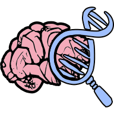

<p align="center">
  <a href="https://sysndd.dbmr.unibe.ch/">
    
  </a>
</p>

<h3 align="center">
SysNDD is the expert curated database of gene disease relationships in <mark>neurodevelopmental</mark> <mark>disorders</mark> (NDD).
</h3>


## The SysNDD GitHub repository

This repository is for development of our SysNDD web application (app), application programming interface (api) and relational database (db). Browse the sub-foldes to view the respective readme files and source code.

## Table of contents

- [Quick start](#quick-start)
- [Contributing and community](#contributing-and-community)
- [Bugs and feature requests](#bugs-and-feature-requests)
- [Creators](#creators)
- [Thanks and acknowledgments](#thanks-and-acknowledgments)
- [Copyright and license](#copyright-and-license)

## Quick start
The SysNDD installation depends on docker and docker-compose.
If these are installed the project can be installed locally using the provided shell script:

```
bash deployment.sh "<config.tar.gz>"
```

- A dummy config file for local deployment will be provided in this repository.
- Data and a script to populate the MySQL database will be provided in this repository.

## Contributing and community
To contribute in curating novel entries to our database you can register for a new reviewer/ curator [account on the SysNDD page](https://sysndd.dbmr.unibe.ch/Register).


## Bugs and feature requests
If you have technical problems using SysNDD or requests regarding the data or functionality, please contact us at support [at] sysndd.org.


## Creators

**Bernt Popp**

- <https://twitter.com/berntpopp>
- <https://github.com/berntpopp>
- <https://orcid.org/0000-0002-3679-1081>
- <https://scholar.google.com/citations?user=Uvhu3t0AAAAJ&hl>

**Christiane Zweier**

- <https://orcid.org/0000-0001-8002-2020>
- <https://scholar.google.com/citations?user=KE0N1r8AAAAJ&hl>


## Thanks and acknowledgments
The current SysNDD database development is supported by:
- DFG (Deutsche Forschungsgemeinschaft) grant PO2366/2-1 to Bernt Popp.
- DFG (Deutsche Forschungsgemeinschaft) grant ZW184/6-1 to Christiane Zweier.
- ITHACA ERN through Alain Verloes.
The previous SysID database and data curation was supported by:
- The European Union’s FP7 large scale integrated network GenCoDys (HEALTH-241995) to C Webber, MA Huynen and Annette Schenck.
- VIDI and TOP grants (917-96-346, 912-12-109) from The Netherlands Organisation for Scientific Research (NWO) to Annette Schenck.
- DFG (Deutsche Forschungsgemeinschaft) grants ZW184/1-1 and -2 to Christiane Zweier.
- the IZKF (Interdisziplinäres Zentrum für Klinische Forschung) Erlangen to Christiane Zweier.
- ZonMw grant (NWO, 907-00-365) to Tjitske Kleefstra.

We would like to acknowledge Annette Schenck and Martijn Huynen and their groups from Radboud University Medical Center Nijmegen, The Netherlands, who initially brought SysID into life and maintained and supported it for many years. We would also like to thank all users for using SysID and for positive feedbacks, thus making the sometimes tedious updates and the re-organization into the new SysNDD database worth it. Since recently, Alain Verloes and ERN ITHACA provide valuable encouragement and support by initiating and supporting the data integration with Orphanet and helping with the recruitment of expert curators.


## Copyright and license
- All code from this project is licensed under the "MIT No Attribution" (MIT-0) License - see the LICENSE.md file for details.
- The project data, website and api usage are licensed under the "Attribution 4.0 Internationa" (CC BY 4.0) License - see the [https://creativecommons.org/licenses/by/4.0/](https://creativecommons.org/licenses/by/4.0/) for details.