The SysNDD web tool is available from [https://sysndd.dbmr.unibe.ch/](https://sysndd.dbmr.unibe.ch/) on a server hosted at the Department for BioMedical Research ([DBMR](https://www.dbmr.unibe.ch/)) (University of Bern) and the web address [https://sysndd.org/](https://sysndd.org/) redirects to this server.

The web tool is a Vue 3 single-page application written in TypeScript and built with Vite. It uses Bootstrap 5 and Bootstrap-Vue-Next for the component layer.

## Landing page

The landing page provides:

1) a navigation menu at the top,
2) the main site content, which changes with navigation to other routes, and
3) a footer navigation bar at the bottom

Screenshot of the landing page:

::: {.doc-screenshot}
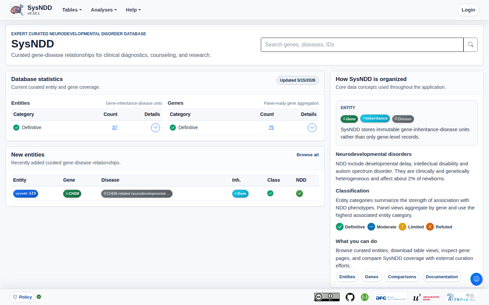
:::

The landing page content includes the following elements to provide a quick overview and allow for easy navigation:

- a centered search input at the top,
- a box (left side top) with current gene statistics divided by association category and inheritance patterns (*Details*),
- a box (left side bottom) showing a table of the five last entities entered into the database,
- explanatory text on the right.

## Main navigation menu

The main navigation allows quick access to all sub-pages.

The *Tables* button triggers a dropdown menu with links to:

- *Entities* table view
- *Genes* table view
- *Phenotypes* table view
- *Panels* table view

::: {.doc-screenshot}
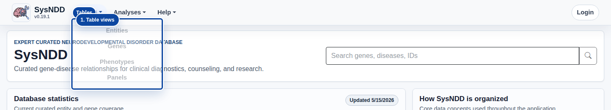
:::

The *Analyses* button triggers a dropdown menu with links to:

- *Compare curations* view
- *Correlate phenotypes* view
- *Correlate variants* view
- *Entries over time* view
- *NDD Publications* view
- *PubTator Analysis* view
- *Functional clusters* view
- *Pheno-Func Correlation* view

::: {.doc-screenshot}
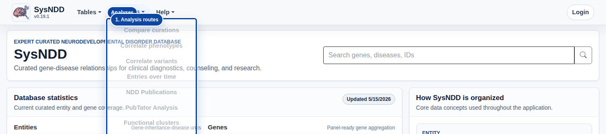
:::

The *Help* button triggers a dropdown menu with links to:

- *About*
- *Docs and FAQ*

::: {.doc-screenshot}
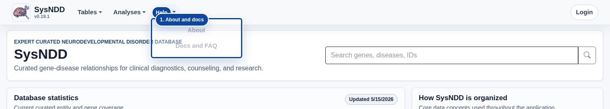
:::

If not on the landing page, a search bar also appears on the navigation menu.

::: {.doc-screenshot}
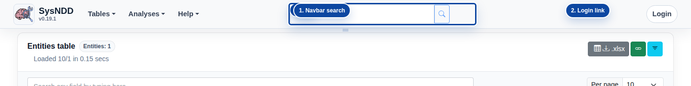
:::

If not logged in, the right side of the menu shows a button which directs you to the *Login* page.
When logged in as a registered user the menu shows your username and additional links to page views depending on your user rights:

::: {.doc-screenshot}
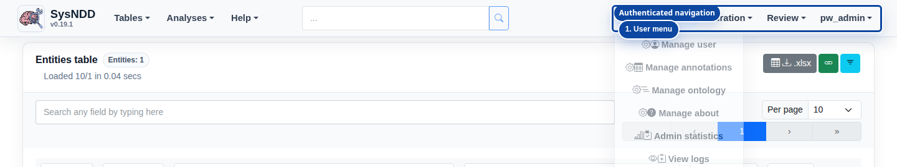
:::

## Footer navigation menu

The footer navigation shows a policy button and logos with links to:

1) usage policy and data privacy disclaimer
2) the license applied to SysNDD
3) our GitHub repository
4) the SysNDD API view
5) the DFG funder website
6) the website of the University of Bern hosting our server
7) the ERN-ITHACA website

::: {.doc-screenshot}
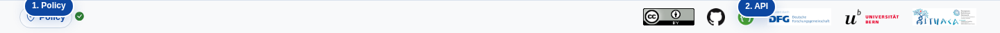
:::

## Table views

We provide tabular representations with search, filtering, sorting and pagination functionality for different aspects of the entity concept.

### Entities table

The *Entities* table is intended to provide an overview centered on the entity concept.

::: {.doc-screenshot}
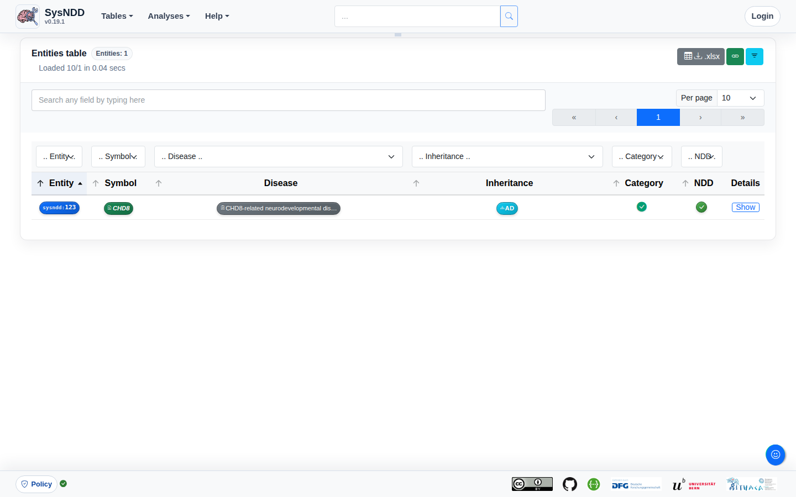
:::

### Genes table

The *Genes* table is intended to provide a gene-centered overview.

::: {.doc-screenshot}
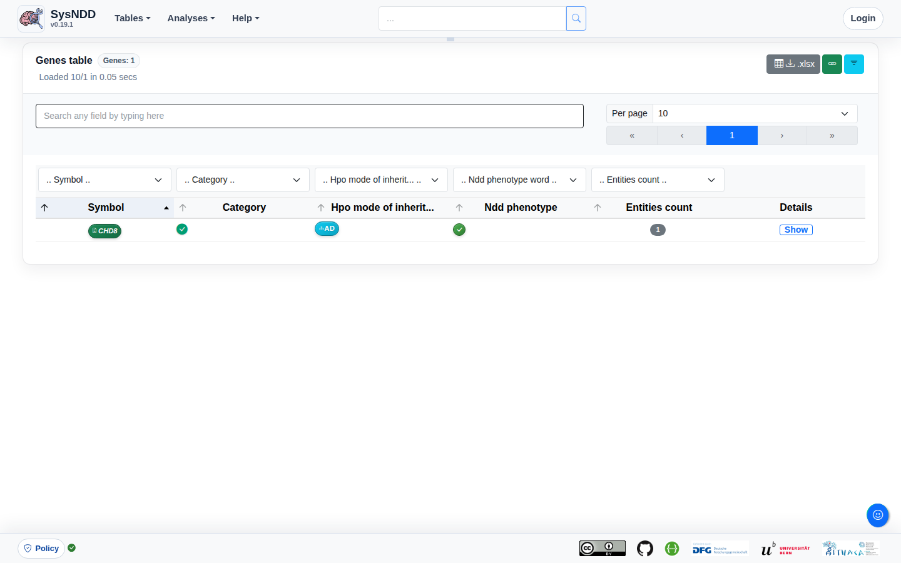
:::

### Phenotypes table

The *Phenotypes* table provides the possibility to filter for phenotype combinations annotated to the entities.

::: {.doc-screenshot}
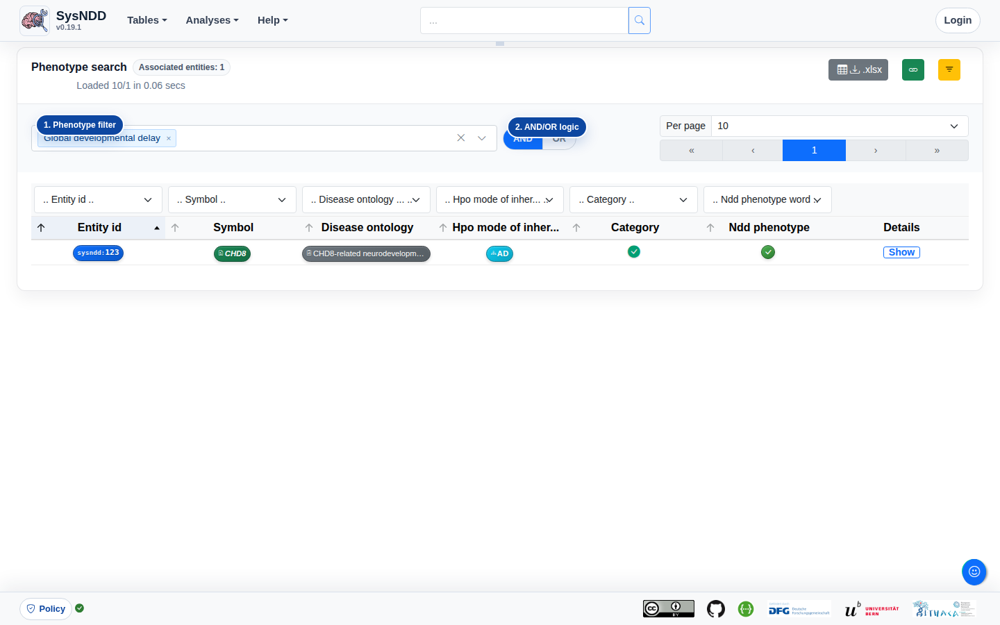
:::

The **AND/OR** switch controls how phenotype combinations are matched:

- AND: only entities having all selected phenotypes annotated are shown
- OR: all entities having any of the selected phenotypes annotated are shown

The *Entities*, *Genes* and *Phenotypes* tables include toolbar actions in the top right:

1) an `.xlsx` button to download the current table data
2) a link icon that copies the current page URL
3) a filter icon that removes active filters; the icon color indicates whether filters are active

::: {.doc-screenshot}
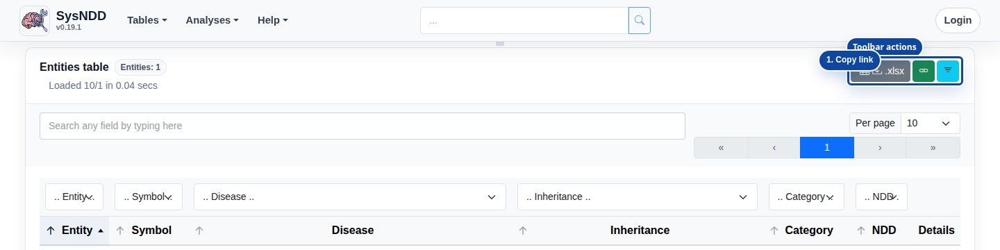
:::

### Panels table

The *Panels* table is intended for users to be able to create lists of NDD-associated genes. Additionally, the columns in the lists can be configured. Finally, the configuration can be downloaded as an Excel file with information on the exact query in the meta sheet and the requested information in the data sheet. These files can then be used as 'virtual panels' to filter genetic variants derived from high-throughput sequencing in external analysis tools.

::: {.doc-screenshot}
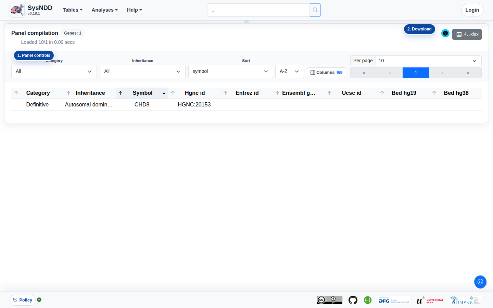
:::

## Single entry pages

Single entry pages are the dedicated pages associated with each entity, gene, or disease ontology. They are opened from the entity, gene, or disease buttons associated with each table row.

::: {.doc-screenshot}
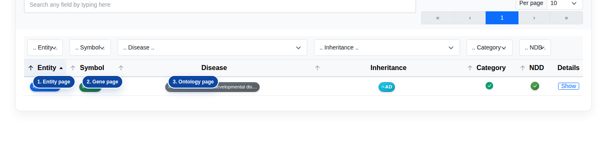
:::

### Entity

The *Entity* page aims to provide information on the gene, disease (with the OMIM link), inheritance pattern and NDD status associated with a particular entity. The synopsis and phenotypes of the disease as well as the relevant links to publications (including GeneReviews if available) are also provided.

::: {.doc-screenshot}
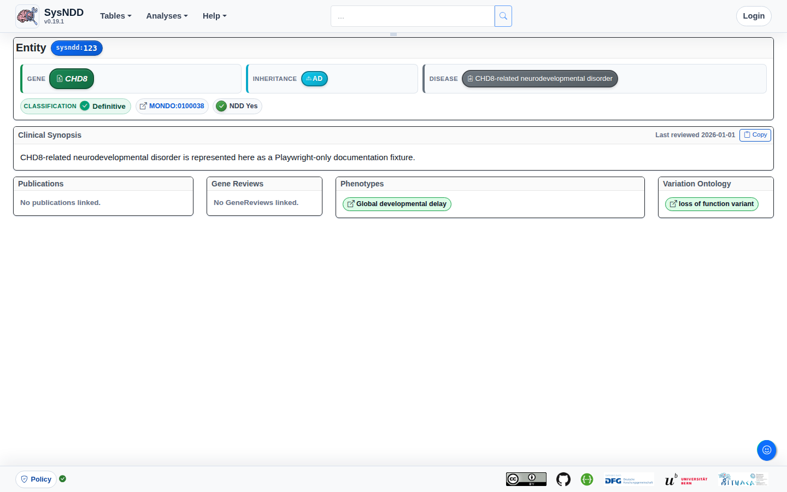
:::

### Gene

The *Gene* page aims to provide further information on 1) the gene of interest with links to other platforms such as Entrez, Ensembl, UCSC, CCDS, UniProt, OMIM gene, MGI, RGD and STRING,  and 2) the entities associated with the gene in a table format.

::: {.doc-screenshot}
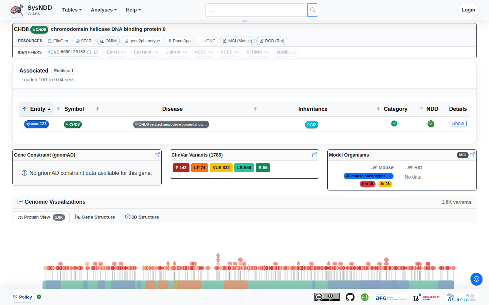
:::

### Disease ontology

The *Ontology* page provides disease metadata, links to external resources such as OMIM, DOID, MONDO, and Orphanet, and a table of associated SysNDD entities.

::: {.doc-screenshot}
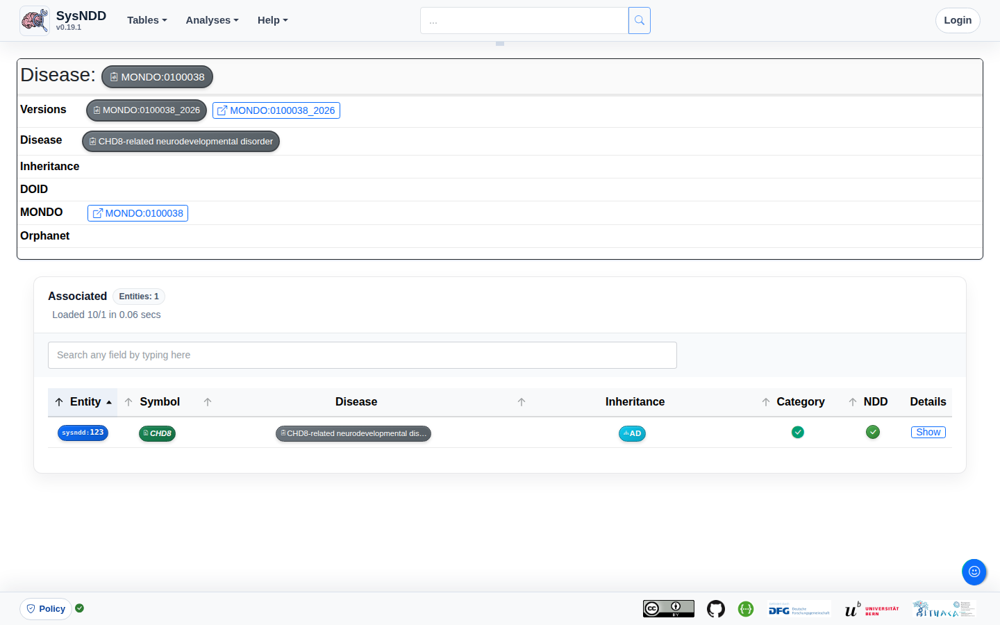
:::

## Analyses views

The *Analysis* views are intended to provide the user with a more comprehensive picture of SysNDD comparisons with other curations, phenotype correlations, SysNDD entries over time, NDD publications, and functional gene clusters.

### Compare curations

The *Compare curations* view is composed of three tabs:

1) *Overlap*
2) *Similarity*
3) *Table*

The *Overlap* tab includes an upset plot (alternative for venn diagrams, please compare: [upset.app](https://upset.app/)) to show the overlap between SysNDD and other selected NDD curation efforts.

::: {.doc-screenshot}
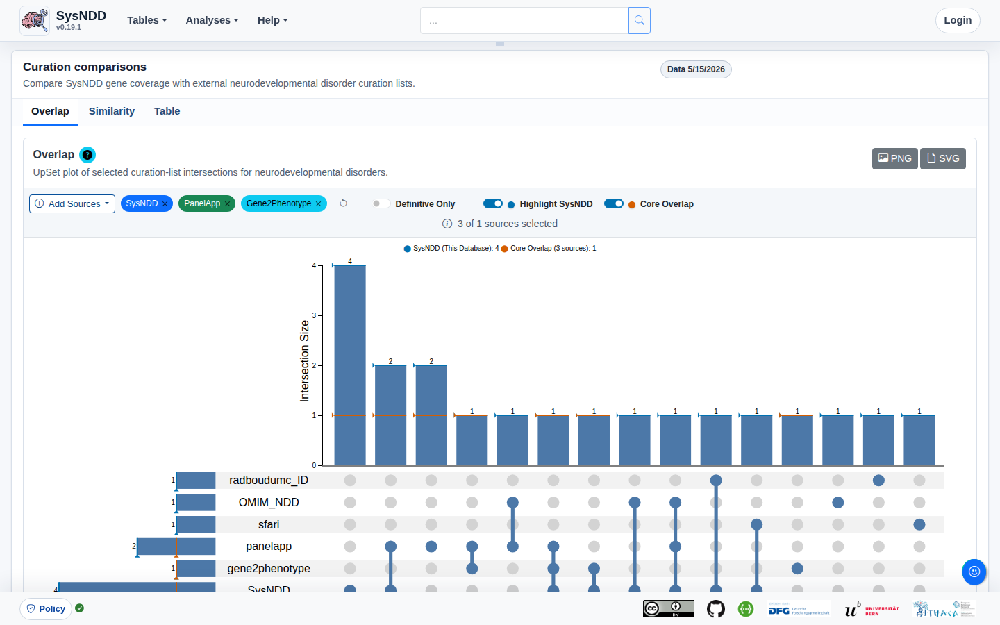
:::

The *Similarity* tab includes a matrix plot of the cosine similarity between different curation efforts for neurodevelopmental disorders.

::: {.doc-screenshot}
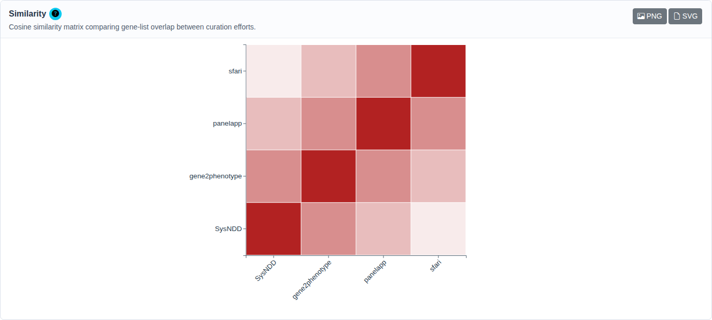
:::

The *Table* tab presents a table format for comparing a gene's presence across various neurodevelopmental disorder curation initiatives. The comparison table can also be downloaded as an Excel file using this tab. In the upper right corner, there is a button to remove the filter.

::: {.doc-screenshot}
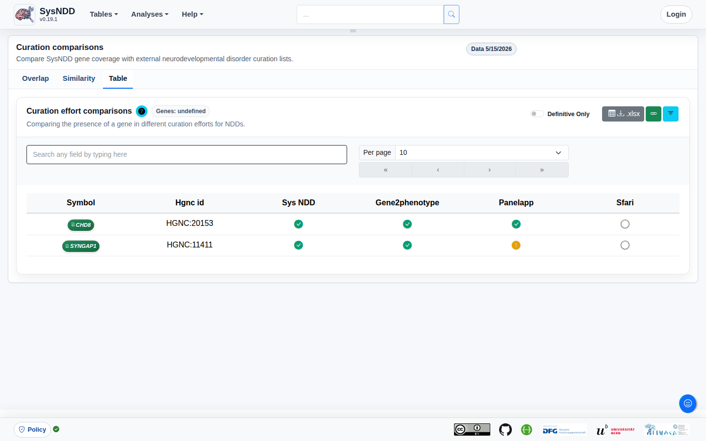
:::

### Correlate phenotypes

*Correlate phenotypes* view is composed of three tabs:

1) *Phenotype correlogram*
2) *Phenotype counts*
3) *Phenotype clustering*

The *Phenotype correlogram* tab displays a matrix of correlations of different phenotypes.

::: {.doc-screenshot}
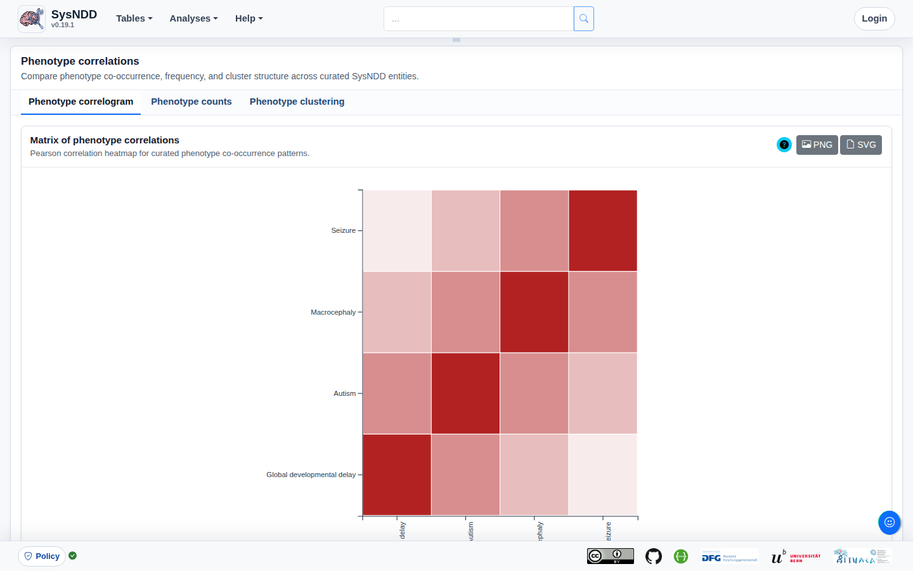
:::

The *Phenotype counts* tab shows a bar plot of phenotype counts.

::: {.doc-screenshot}
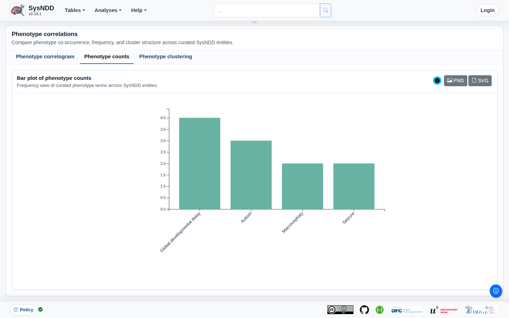
:::

The *Phenotype clustering* tab shows clusters of entities based on the manually curated phenotype annotations from SysNDD.
Multiple correspondence analysis (MCA) is performed utilizing the "MCA" function from the [FactoMineR](http://factominer.free.fr/) R package, with the number of dimensions retained set to 15, the qualitative supplementary variables set to inheritance terms, and the quantitative supplementary variables set to phenotype counts divided into ID-related and non-ID-related phenotypes (indicator of "syndromicity"). Then, hierarchical clustering is performed using the "HCPC" function from the FactoMineR package.
By clicking on the different colored bubbles on the panel to the left, the user can select the respective clusters. When clicking a cluster the entity count is displayed in the upper part along the cluster name. The link in this panel's lower section leads to a view of the Entity table that is restricted to the entities in the selected cluster.
The right-hand panel displays a table containing either (1) the *Qualitative input variables* representing the phenotypes, (2) the *Qualitative supplementary variables* (independent) representing inheritance patterns, or (3) the *Quantitative supplementary variables* (independent) representing the count of phenotypes, all with variable name, p-values, and v-test values.

::: {.doc-screenshot}
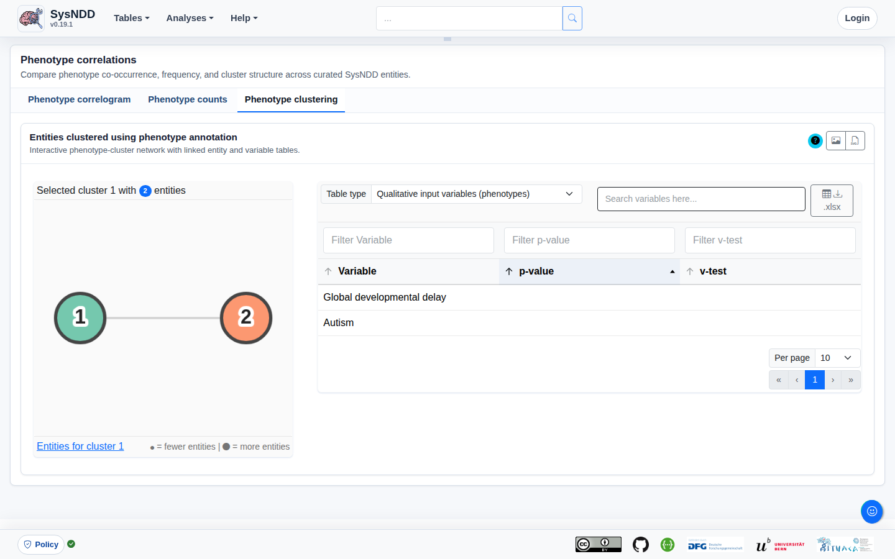
:::

### Entries over time

The *Entries over time* view displays the changes in NDD entity numbers since curation began. The plot can be aggregated by either genes or entities and categorized according to inheritance or category.

::: {.doc-screenshot}
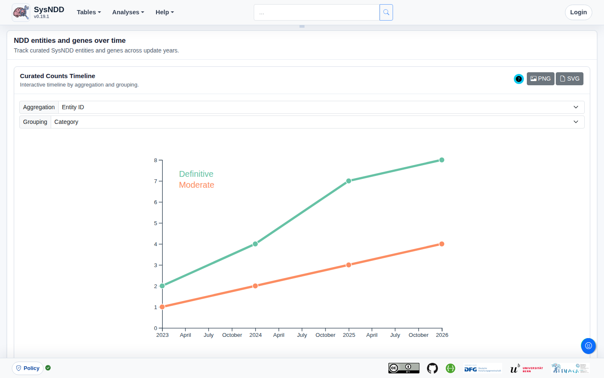
:::

### NDD Publications

The *NDD Publications* view summarizes publications relevant to neurodevelopmental disorder gene curation. It provides a searchable publication table and companion analysis tabs for publication activity over time and source statistics. The view helps curators and users inspect how publication evidence is distributed across the SysNDD literature corpus.

::: {.doc-screenshot}
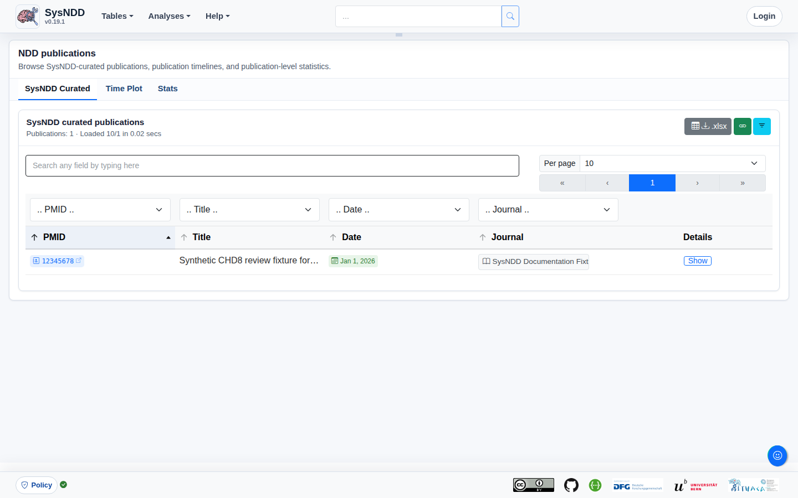
:::

### Functional clusters

The *Functional clusters* view displays gene clusters of functionally enriched interacting proteins, along with their corresponding ontology annotations. Using the "get_clusters" function from the [STRINGdb](https://rdrr.io/bioc/STRINGdb) R package and the "walktrap" clustering algorithm from the [igraph](https://igraph.org/) R package, we perform clustering.
Users can focus the functional cluster view by selecting a cluster directly in the network visualization, from the cluster legend, or from the cluster dropdown. A single-cluster selection filters the enrichment and gene tables to that cluster and displays the AI-generated cluster summary when an approved summary is available. Clicking the empty network background or choosing *All Clusters* returns to the broad all-clusters comparison view.
The right-hand panel displays a table with either (1) the *Term enrichment* including the ontology annotations, the number of enriched genes, the FDR-corrected p-value, and a link to the corresponding ontology term or (2) the gene *Identifiers* with links to the respective single entry page and to the [STRING](https://string-db.org/) website of the protein.

::: {.doc-screenshot}
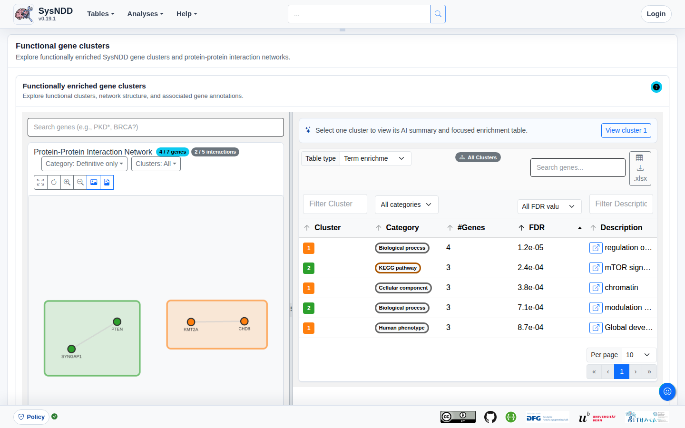
:::

## About page

The website's About page provides general information about the project, such as its creators, funding sources, the status of updates, and how to get help.

## Help & Feedback

On each page of SysNDD, a floating smiley-face button points users to the following help and feedback features:

- Button **1** allows the user to cite the page (quotation mark icon), copies the recommended citation text to the clipboard and automatically creates a snapshot of the website in the internet archive for reproducibility ([Wayback Machine - Internet Archive](https://archive.org/web/))
- Button **2** directs the user to a form for positive feedback (*Like*)
- Button **3** directs the user to a form for improvement suggestions (*Improve*)
- Button **4** directs the user to the SysNDD documentation (*Docs*)
- Button **5** directs the user to the SysNDD GitHub discussions page for questions and help (*Help*)

::: {.doc-screenshot}
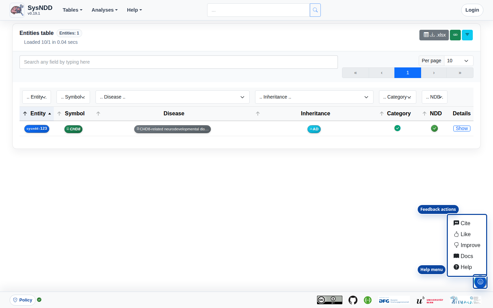
:::

## Reporting bugs, problems and making feature requests

If you have technical problems using SysNDD or requests regarding the data or functionality, please contact us at support [at] sysndd.org.

When reporting a technical problem, include a minimal problem report:

- page URL or route;
- date, time, and browser;
- logged-in role, if the problem happened after login;
- exact steps that reproduce the problem;
- expected result;
- observed result;
- visible error message, if present;
- console errors or a saved console log, if available;
- whether the problem repeats after reloading the page.

Avoid sending passwords, authentication tokens, personal identifiers, unpublished patient-level details, or other sensitive material in screenshots or console logs.

::: {.doc-screenshot}
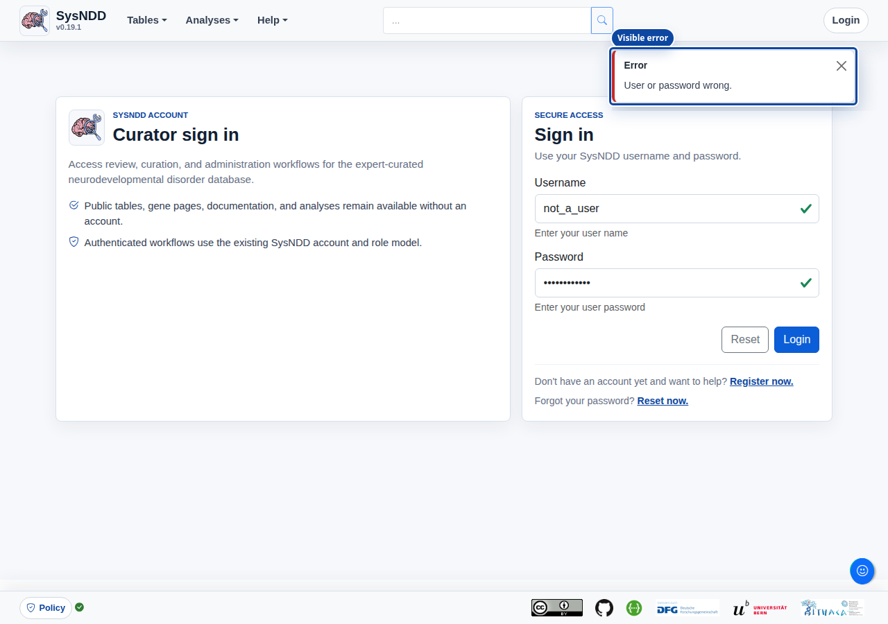
:::

For Chromium-based browsers such as Chrome or Edge:

1. Open Developer Tools with `F12`, `Ctrl+Shift+J`, or the browser menu.
2. Select the Console tab.
3. Reproduce the problem.
4. Right-click in the Console and save or copy the console output.
5. Send the saved log with the minimal problem report.

Browser Developer Tools are controlled by the browser, not the SysNDD application, so the exact menu text and layout can differ between Chrome, Edge, Firefox, and Safari.

## Login page

The Login page shows a simple form with inputs for the **(1)**  user name and their **(2)**  password,  **(3)** buttons to reset the form and  **(4)** links to registration and password reset.

::: {.doc-screenshot}
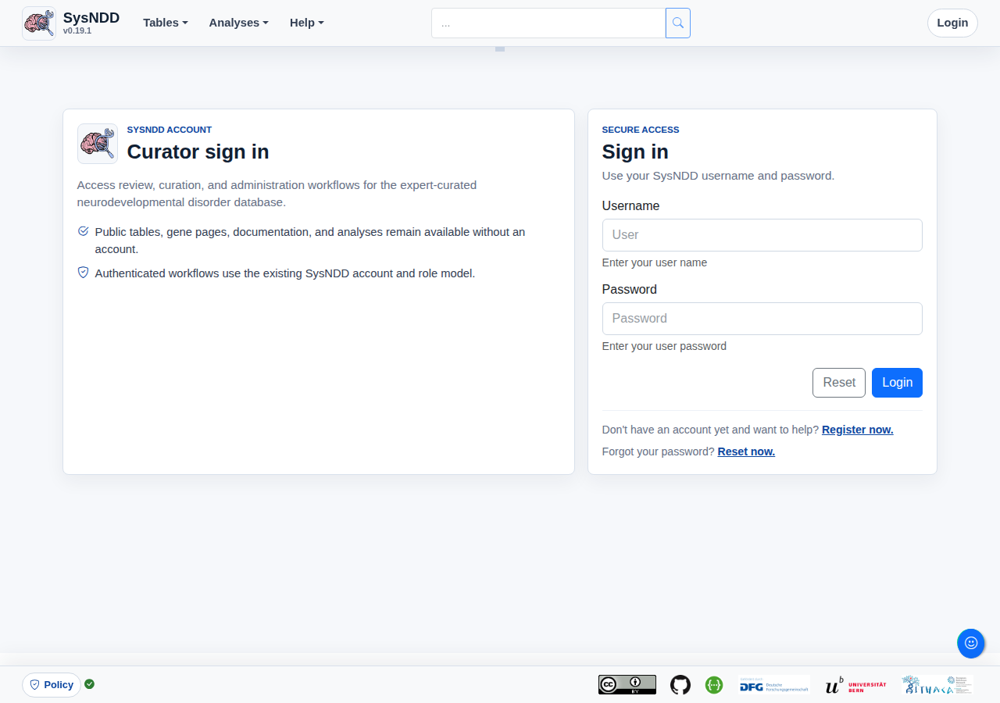
:::

### Register user page

This page can be used to apply for a SysNDD account by entering the following information:

1) desired username
2) institutional e-mail
3) ORCID identifier
4) first name
5) family name
6) description of your interest in SysNDD and why you want to participate in the curation effort

and **(7)** accepting the terms of use.

The **(8)** buttons allow resetting or submitting the form.

::: {.doc-screenshot}
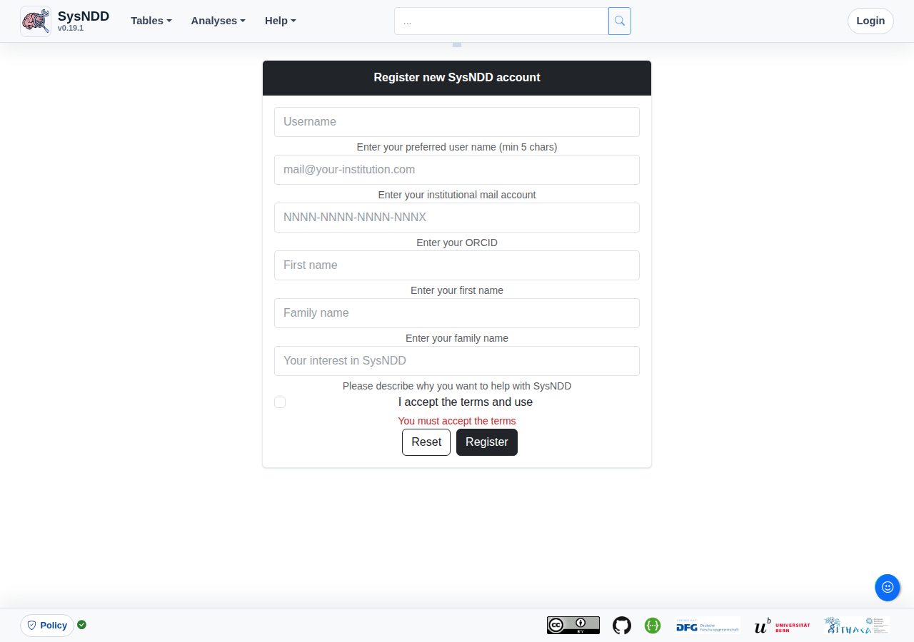
:::

After submitting your application, the curators will receive an email to review it. You will receive an e-mail with your login information and instructions after your application has been confirmed.

### Reset password page

Users who have forgotten their password can reset it by entering the e-mail address they registered with on this page.

::: {.doc-screenshot}
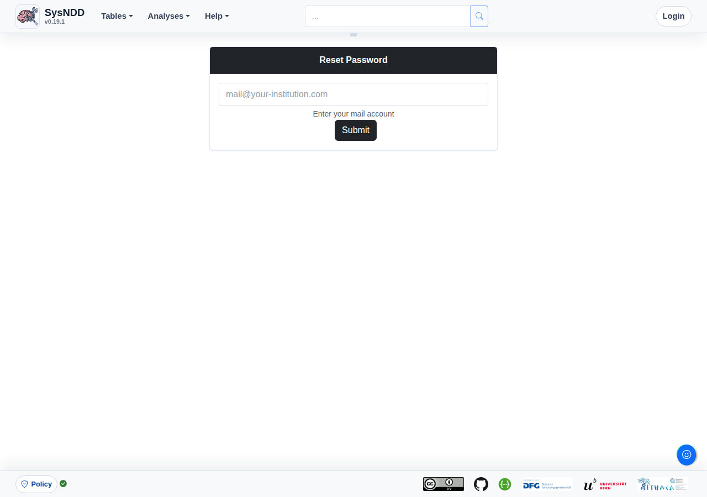
:::

Upon submission the e-mail account will receive a message with a one-time link allowing the user to enter a new password.

## Mobile website

The Vue 3 application uses responsive layouts so SysNDD remains usable on smaller screens. Navigation and footer controls collapse at mobile widths, and table-heavy views use compact mobile rows or reduced controls where the current view supports them.

::: {.doc-screenshot}
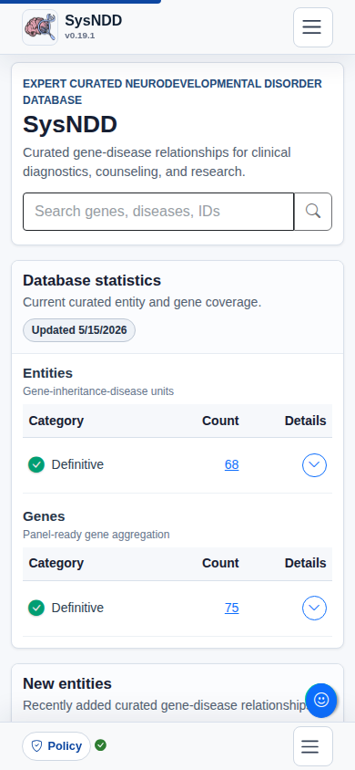
:::

The navigation collapses at smaller desktop/tablet widths, while the footer partner links collapse at narrow mobile widths:

::: {.doc-screenshot}
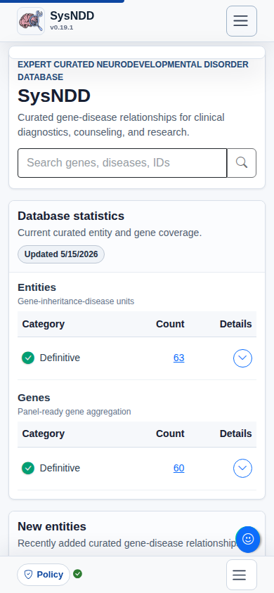
:::

::: {.doc-screenshot}
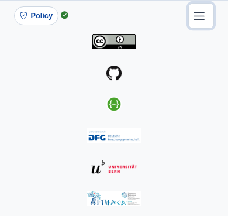
:::

Where supported, table-heavy views use compact mobile rows that keep field labels next to their values on narrow screens:

::: {.doc-screenshot}
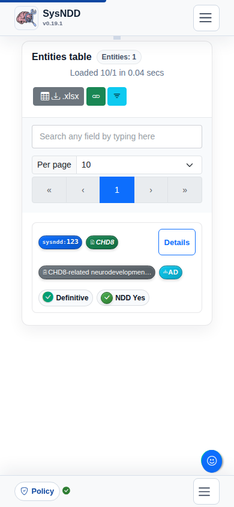
:::

Table controls and search inputs remain available at the top of these views.

The *Analyses* pages on mobile are best viewed in landscape mode:

::: {.doc-screenshot}
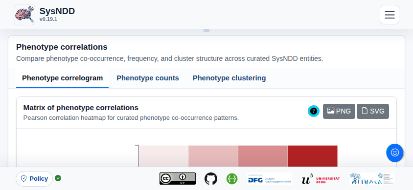
:::

## Progressive Web App (PWA)

The SysNDD web app can also be installed on mobile devices using the Progressive Web App ([PWA](https://en.wikipedia.org/wiki/Progressive_web_application)) technology.
This is supported in all Chromium-based modern browsers (Chrome, Edge, Opera, etc.) on all common operating systems (Windows, Linux, macOS and Android). Additionally new Safari versions on iOS show some support for PWA.

PWAs are faster because they cache files. They offer more screen space for the app. Future integrations of this feature in SysNDD will enable offline use.

Browser-controlled install prompts differ by browser and operating system, so they are not reproduced as SysNDD application screenshots. In general, install the PWA from the browser's app or install menu after visiting [https://sysndd.dbmr.unibe.ch/](https://sysndd.dbmr.unibe.ch/), then confirm the browser prompt.

::: {.doc-screenshot}

:::

## Performance

Modern JavaScript frameworks like Vue.js, which we use for the SysNDD website, offer rich user experience. The generated single-page applications can be slower than server side rendered pages.

With SysNDD we are engaged to provide a fast user experience by reducing component and request sizes and applying techniques like lazy loading and code splitting in the frontend with parallelisation in the api.

A quick overview on the current website performance can be obtained on PageSpeed Insights (or "Lighthouse" in the Chrome development console):

[https://pagespeed.web.dev/report?url=https%3A%2F%2Fsysndd.dbmr.unibe.ch%2F](https://pagespeed.web.dev/report?url=https%3A%2F%2Fsysndd.dbmr.unibe.ch%2F&form_factor=desktop)

## Security

SysNDD is engaged to offer highest security standards for all web tools.
We use HTTPS with Transport Layer Security (TLS) and follow the Mozilla recommendations for web server settings.

A quick overview for our security settings for the SysNDD website can be obtained on Mozilla Observatory:

[https://observatory.mozilla.org/analyze/sysndd.dbmr.unibe.ch](https://observatory.mozilla.org/analyze/sysndd.dbmr.unibe.ch)
