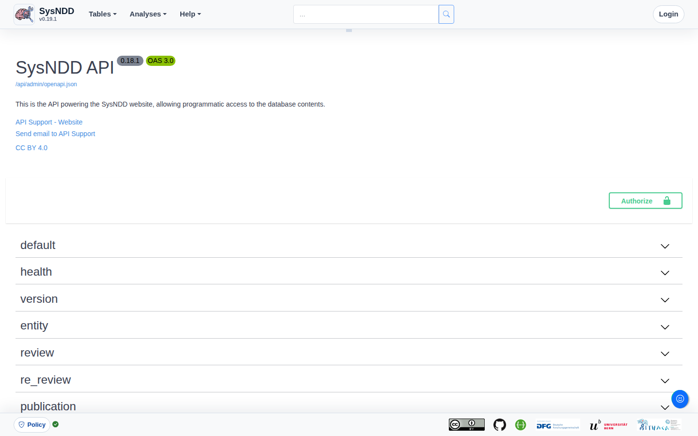
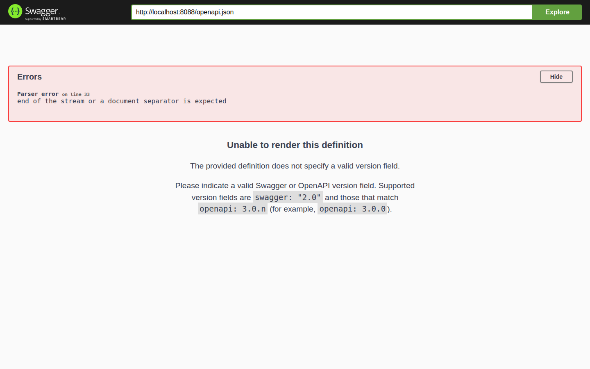

The SysNDD API documentation interface is available from [https://sysndd.dbmr.unibe.ch/API](https://sysndd.dbmr.unibe.ch/API). API endpoints are served under the `/api` path.

The API is written in R using the [plumber package](https://www.rplumber.io/) and runs in Docker from the repository API image based on `rocker/r-ver`. In the current Compose deployment, Traefik routes web traffic to the API service under `/api`.

Runtime and rate-limit behavior can change with deployment configuration. Operator-facing deployment details are maintained in the deployment chapter.

We intend to follow the [Swagger/OpenAPI](https://swagger.io/specification/) and [JSON:API](https://jsonapi.org/) specifications.

## Endpoints

The runtime is composed by `api/start_sysndd_api.R`, which sources helpers, core modules, services, and endpoint files through the bootstrap layer. Endpoint files are mounted under `/api/<subpath>` by `api/bootstrap/mount_endpoints.R`.

Mounted endpoint groups include:

- health and version: service readiness and version discovery
- entity, gene, ontology, phenotype, panels, publication, variant, and list: core data resources
- review, re_review, and status: curation and review workflows
- comparisons and analysis: analysis and NDD gene-list comparison resources
- search, hash, and statistics: lookup, stable links, and summary resources
- user and auth: user account and authentication resources
- about and seo: public content and prerender payload resources
- jobs, logs, admin, llm, backup, and external: authenticated operational resources

The endpoints are documented and can be tested using the Swagger/OpenAPI user interface at [https://sysndd.dbmr.unibe.ch/API](https://sysndd.dbmr.unibe.ch/API).
Here one can generate cURL requests to use in external software.

::: {.doc-screenshot}

:::

## Read-only MCP sidecar

SysNDD can also run an optional Model Context Protocol (MCP) sidecar from `api/start_sysndd_mcp.R`. The MCP sidecar is a separate R process/container and is not mounted inside the Plumber API process.

MCP v1 is read-only and private/internal by default. The production Compose service has no Traefik labels and therefore is not publicly exposed unless an operator explicitly adds a protected route. The current `mcptools` HTTP transport listens at the service root; a reverse proxy can expose that as `/mcp` with path stripping when protected access is configured.

Available MCP tools:

- `search_sysndd`
- `get_gene_context`
- `get_genes_context`
- `get_entity_context`
- `get_entities_context`
- `list_gene_entities`
- `get_publication_context`
- `get_publications_context`
- `find_entities_by_phenotype`
- `find_entities_by_disease`
- `get_sysndd_stats`
- `get_sysndd_capabilities`

The intended LLM retrieval path is `search_sysndd` -> `get_gene_context` -> `get_entities_context` -> `get_publications_context`. If a client defers MCP tool schemas, load `search_sysndd`, `get_gene_context`, `get_genes_context`, `get_entities_context`, `get_publications_context`, and `get_sysndd_capabilities` before the first SysNDD call. `get_sysndd_capabilities` returns in-band guidance for workflows, limits, payload modes, citations, resources, errors, prompt opt-in status, and safety scope. Use `get_gene_context(expand = "entities")` for a one-call gene + entity detail response when the caller explicitly wants to spend the tokens, `get_genes_context` for 1-10 genes with per-gene errors, and `get_entities_context` for 1-20 entity IDs when a gene, disease, or phenotype lookup returns several entities that need detail in one call. SysNDD entities are gene-disease-inheritance curation records, so one gene can have multiple entities. `get_gene_context` accepts `gene`; hidden deprecated aliases are not supported. Tool descriptions include short example calls and boolean defaults.

Payload controls are part of the MCP contract: `response_mode` is `minimal`, `compact`, `standard`, or `full`; `abstract_mode` is `none`, `metadata`, or `excerpt`; and `synopsis_mode` is `none`, `excerpt`, or `full`. `minimal` defaults to no synopsis and no abstracts. Other modes default to citation metadata rather than prose; request `excerpt` or `full` only when text is needed. Tool results report `meta.elapsed_ms`. Entity phenotypes are grouped as modifier-keyed HPO ID arrays, and batch/expanded payloads keep `schema_version` only at the outer envelope. `abstract_mode = "metadata"` reports `abstract_available` without `abstract_excerpt` or `abstract_truncated`. `get_gene_context` defaults `include_comparisons` to false for the cheap path and reports first-page entity metadata in `meta.entity_total`, `meta.entity_returned`, `meta.entity_has_more`, and `meta.next_entity_offset`. `expand = "entities"` can return one-call gene plus entity detail, with detailed expansion capped at 20 entity IDs and `meta.entity_detail_truncated_by_batch_cap` reporting when that cap was applied. `get_entities_context` defaults `dedupe_publications` to true, moving shared publication objects to a top-level `publications` list and leaving per-entity `publication_refs`.

Publication outputs include `recommended_citation`, `publication_date_sysndd_record`, `publication_date_confidence`, and optional abstract fields controlled by `abstract_mode`; linked entity review dates are reported separately as `sysndd_curation_date`. `recommended_citation` omits the year when the publication date is unverified. Historical rows remain unverified until the one-off PubMed backfill is applied.

MCP prompts are disabled by default. The MCP and Claude Code documentation model prompts as user-controlled slash-command templates, not automatically discovered LLM workflows. Keep the agent-discoverable workflows in tools, resources, and `get_sysndd_capabilities`; set `MCP_ENABLE_PROMPTS=true` only for deployments that intentionally want slash commands such as `sysndd_gene_evidence_summary`, `sysndd_entity_evidence_brief`, `sysndd_publication_citation_pack`, and `sysndd_phenotype_entity_discovery`. Prompts provide workflow instructions only; they do not perform generation, writes, or external calls.

The static `sysndd://schema/overview` and `sysndd://schema/tool-guide` resources are available through `resources/list` and `resources/read` and document schema and tool usage as distinct resources. Record-level `sysndd://gene`, `sysndd://entity`, and `sysndd://publication` URIs in tool payloads are stable identifiers; v1 retrieval remains tool-based rather than parameterized resource templates.

The MCP service exposes only approved public data: active records represented by `ndd_entity_view` and review-derived evidence from primary approved reviews (`is_primary = 1` and `review_approved = 1`). It must not expose draft reviews, re-review assignments, admin/user/log/job data, raw SQL/R execution, external provider calls, or Gemini-backed generation.

The Phase 0 transport spike proved `mcptools` HTTP initialize -> `tools/list` -> `tools/call`, `GET 405`, no required session header, and JSON-serialized text tool output. MCP v1 therefore keeps stable JSON text with `schema_version` as the compatibility contract. The sidecar patches `mcptools` initialize metadata, static resources, optional prompts, read-only tool annotations, output schemas, and recoverable tool errors so clients receive SysNDD-specific workflow instructions and can self-correct invalid inputs. Known tool validation errors return a JSON payload with `error.code` and `isError = true`, not JSON-RPC `-32603`.

The Docker healthcheck is deliberately lighter than the smoke probe: it only verifies `initialize` and `tools/list` against the local MCP endpoint. Use `make test-mcp-smoke` for end-to-end tool behavior that depends on approved public DB content.

## Usage policy

The SysNDD API powers the web tool for everyday users. We also provide the SysNDD API free to allow users to use the SysNDD data and build on it by creating software or services that connect to our platform.

Usage requirements:

- optimize your requests to stay within deployment limits
- be sensible about reusing data (e.g., store your requests until data is updated on our server)
- use pagination where possible instead of requesting large data chunks (e.g., restrict usage of "all" option in large, potentially blocking list endpoints like "entity" and "gene")
- if you require more API resources please get in contact

Updates and disclaimer:

- We provide the SysNDD API as is.
- Due to the current development status (version 0.X.Y) we may update or modify the API any time. These changes may affect your use of the API or the way your integration interacts with the API.

## Authentication and authorization

The SysNDD API uses JSON Web Tokens ([JWT](https://jwt.io/)) to implement stateless authentication and authorization.

For testing, an API user can manually request a token by entering login credentials at the `api/auth/authenticate` endpoint:

::: {.doc-screenshot}

:::

The endpoint returns a JWT. Copy the Bearer token into the OpenAPI/Swagger authorization modal, which opens after clicking the "Authorize" button in the API documentation interface. After authorization, the user can access endpoints requiring user rights until the token expires.

The token is valid for 60 minutes. It can be refreshed using the endpoint "api/auth/refresh".
