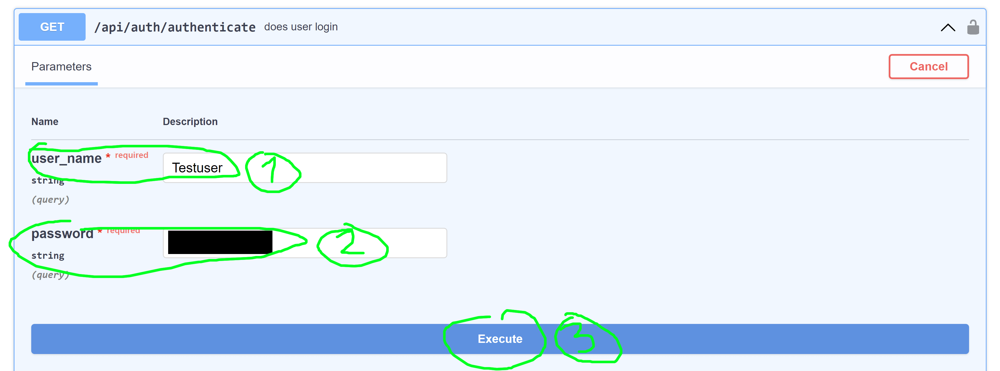
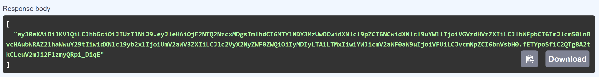
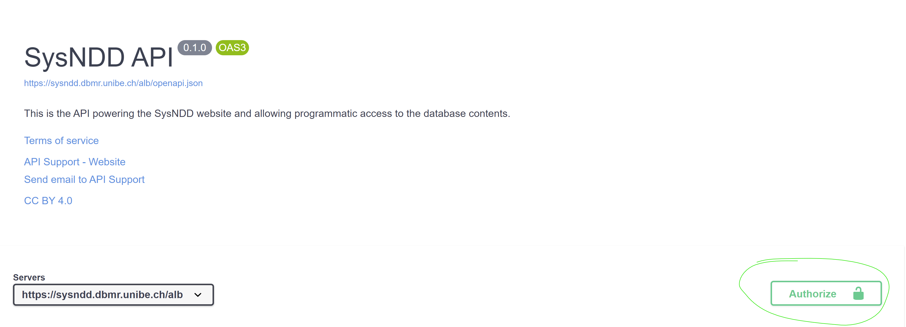
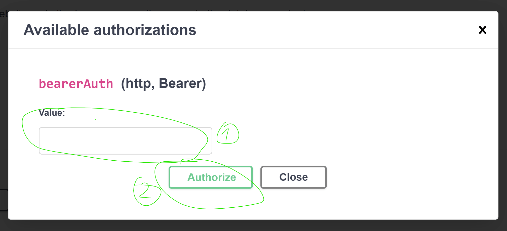
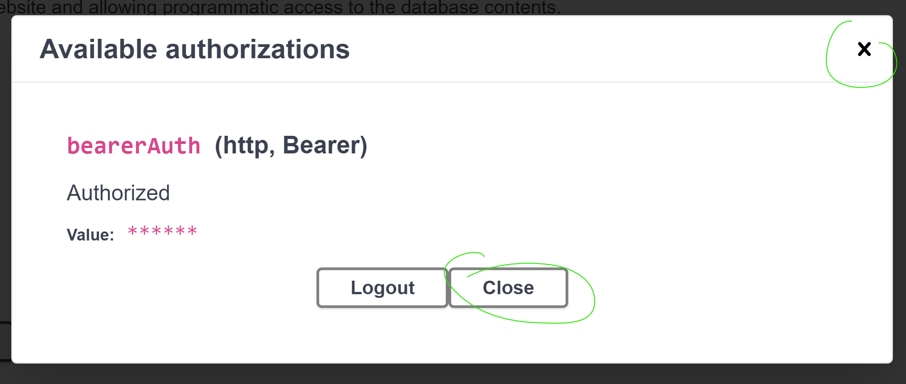
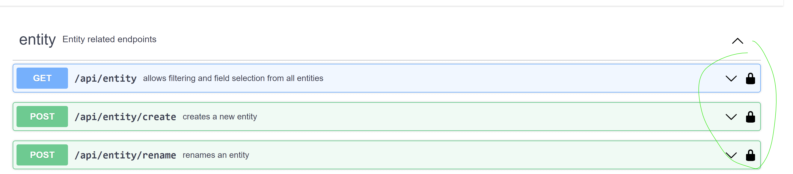

---

The SysNDD API documentation interface is available from [https://sysndd.dbmr.unibe.ch/API](https://sysndd.dbmr.unibe.ch/API). API endpoints are served under the `/api` path.

The API is written in R using the [plumber package](https://www.rplumber.io/) and runs in Docker from the repository API image based on `rocker/r-ver`. In the current Compose deployment, Traefik routes web traffic to the API service under `/api`.

Runtime and rate-limit behavior can change with deployment configuration. Operator-facing deployment details are maintained in the deployment chapter.

We intend to follow the [Swagger/OpenAPI](https://swagger.io/specification/) and [JSON:API](https://jsonapi.org/) specifications.

## Endpoints

The runtime is composed by `api/start_sysndd_api.R`, which sources helpers, core modules, services, and endpoint files through the bootstrap layer. Endpoint files are mounted under `/api/<subpath>` by `api/bootstrap/mount_endpoints.R`.

Mounted endpoint groups include:

- health and version: service readiness and version discovery
- entity, gene, ontology, phenotype, panels, publication, variant, and list: core data resources
- review, re_review, and status: curation and review workflows
- comparisons and analysis: analysis and NDD gene-list comparison resources
- search, hash, and statistics: lookup, stable links, and summary resources
- user and auth: user account and authentication resources
- about and seo: public content and prerender payload resources
- jobs, logs, admin, llm, backup, and external: authenticated operational resources

The endpoints are documented and can be tested using the Swagger/OpenAPI user interface at [https://sysndd.dbmr.unibe.ch/API](https://sysndd.dbmr.unibe.ch/API).
Here one can generate cURL requests to use in external software.

## Usage policy

The SysNDD API powers the web tool for everyday users. We also provide the SysNDD API free to allow users to use the SysNDD data and build on it by creating software or services that connect to our platform.

Usage requirements:

- optimize your requests to stay within deployment limits
- be sensible about reusing data (e.g., store your requests until data is updated on our server)
- use pagination where possible instead of requesting large data chunks (e.g., restrict usage of "all" option in large, potentially blocking list endpoints like "entity" and "gene")
- if you require more API resources please get in contact

Updates and disclaimer:

- We provide the SysNDD API as is.
- Due to the current development status (version 0.X.Y) we may update or modify the API any time. These changes may affect your use of the API or the way your integration interacts with the API.

## Authentication and authorization

The SysNDD API uses JSON Web Tokens ([JWT](https://jwt.io/)) to implement stateless authentication and authorization.

The API user can manually (test purposes) request a token by entering their login credentials in the input form provided at the "api/auth/authenticate" endpoint:

::: {style="max-width:1000px;"}

:::

This endpoint will generate and respond with and JWT token:

::: {style="max-width:1000px;"}

:::

This Bearer token can then be copied and entered in the OpenAPI/Swagger authorize modal, which opens after clicking the "Authorize" modal button at the upper right corner:

::: {style="max-width:1000px;"}

:::

::: {style="max-width:1000px;"}

:::

After entering the token in the respective field (1) and clicking the "Authorize" submission button the modal will change and show the login status. This field can be closed now:

::: {style="max-width:1000px;"}

:::

The user is now fully authenticated and can access the endpoints requiring user rights:

::: {style="max-width:1000px;"}

:::

The token is valid for 60 minutes. It can be refreshed using the endpoint "api/auth/refresh".
