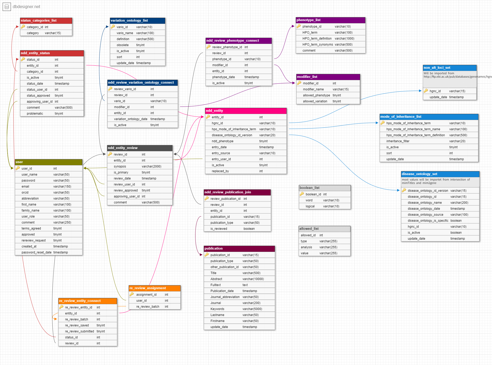

---

## Database software

SysNDD currently uses the open-source [MySQL](https://dev.mysql.com/doc/) relational database management system. The repository Compose stack uses the official MySQL Docker image, currently `mysql:8.4.9`.

## Database schema

The design of our DB schema can be viewed in [DB DESIGNER](https://www.dbdesigner.net/):

::: {style="max-width:1000px;"}
[SysNDD DB schema](https://dbdesigner.page.link/3Morx9HZxzqt4R379)
:::

The diagram below is a documentation snapshot. The versioned schema source of truth is the migration history under `db/migrations/` and the current database initialized by the migration runner.

::: {style="max-width:1000px;"}

:::

## Variant ontology

We use the "Variation Ontology" as ontology for the annotation of variation effects and mechanisms.
Currently active terms include variant ontology terms for our curation. The list was extended to include additional terms for non-coding RNA variation.

The complete list of variation ontology terms can be accessed via:

- The SysNDD API endpoint for variation ontology lists
- The [Variation Ontology (VariO)](https://variationontology.org/) website
- The [EBI OLS Vario terms](https://www.ebi.ac.uk/ols/ontologies/vario)

Reviewer-facing guidance for choosing among existing variation ontology terms is described in the re-review instructions.

## Mode of Inheritance ontology

We use the "Human Phenotype Ontology" as ontology for the mode of inheritance.

The inheritance terms used in SysNDD follow the HPO standard and can be accessed via:

- The SysNDD API endpoint for inheritance lists
- The [Human Phenotype Ontology](https://hpo.jax.org/) website

For the complete and up-to-date list of ontology terms used in SysNDD, please refer to the [SysNDD API documentation](https://sysndd.dbmr.unibe.ch/API).
