# Web tool {#web-tool}

---

The SysNDD web tool is available from [https://sysndd.dbmr.unibe.ch/](https://sysndd.dbmr.unibe.ch/) on a server hosted at the Department for BioMedical Research ([DBMR](https://www.dbmr.unibe.ch/)) (University of Bern) and the web address [https://sysndd.org/](https://sysndd.org/) redirects to this server.

The web tool uses the [Vue.js](https://vuejs.org/) (v2.6) JavaScript framework with BootstrapVue to generate a Bootstrap v4 website frontend.

## Landing page

The landing page is designed as simple Bootstrap v4 website with:

1) a navigation menu at the top,
2) the main site content, which changes with navigation to other routes, and
3) a footer navigation bar at the bottom 

Screenshot of the landing page with elements marked:

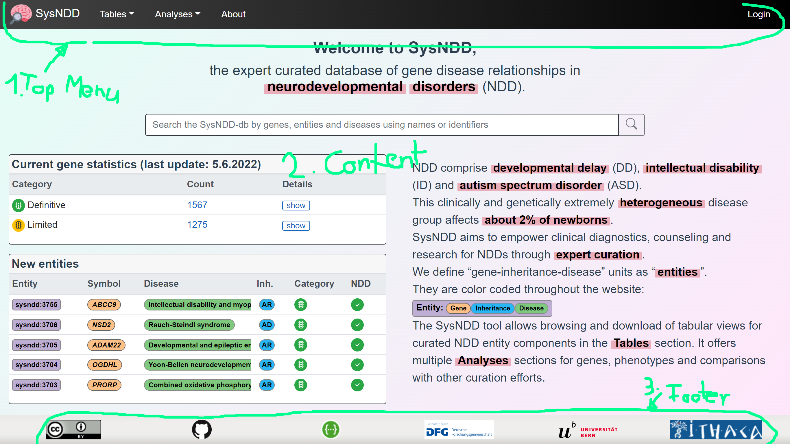{max-width=1000px}

The landing page content displays different elements to give a quick overview and allow fast navigation:

- a centered search input at the top,
- a box (left side top) with current gene statistics divided by association category and inheritance patterns (*Details*),
- a box (left side bottom) showing a table of the five last entities entered into the database,
- an explanatory text  on the right.

## Main navigation menu

The main navigation allows quick access to all sub-pages.

The *Tables* button triggers a dropdown menu with links to:

- *Entities* table view
- *Genes* table view
- *Phenotypes* table view
- *Panels* table view

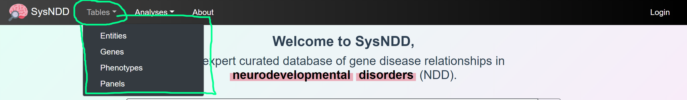{max-width=1000px}

The *Analyses* button triggers a dropdown menu with links to:

- *Compare curations* view
- *Correlate phenotypes* view
- *Entries over time* view
- *NDD Publications* view
- *Functional clusters* view

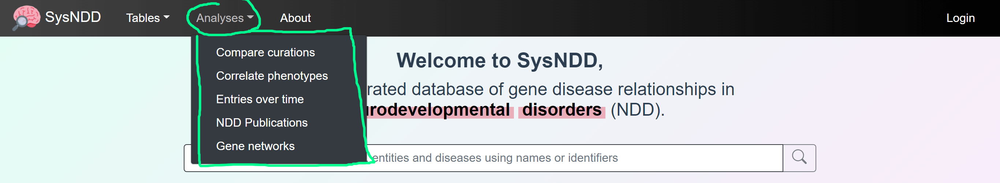{max-width=1000px}

The *About* button directs you to further information on: 

- SysNDD and its creators
- Citation Policy
- Support and Funding
- News and Updates 
- Credits and acknowledgement
- Help and FAQ
- Disclaimer 
- Contact

{max-width=1000px}

If not on the landing page, a search bar also appears on the navigation menu.

{max-width=1000px}

If not logged in, the right side of the menu shows a button which directs you to the *Login* page.
When logged in as a registered user the menu shows your username and additional links to page views depending on your user rights:

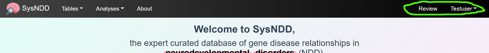{max-width=1000px}

## Footer navigation menu

The footer navigation shows logos with links to:

1) the license applied to SysNDD
2) our GitHub repository
3) the SysNDD API view
4) the DFG funder website
5) the website of the University of Bern hosting our server
6) the ERN-ITHACA website

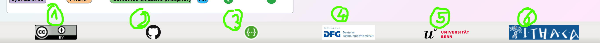{max-width=1000px}

## Table views

We provide tabular representations with search, filtering, sorting and pagination functionality for different aspects of the entity concept.

### Entities table

The *Entities* table is intended to provide an overview centered on the entity concept.

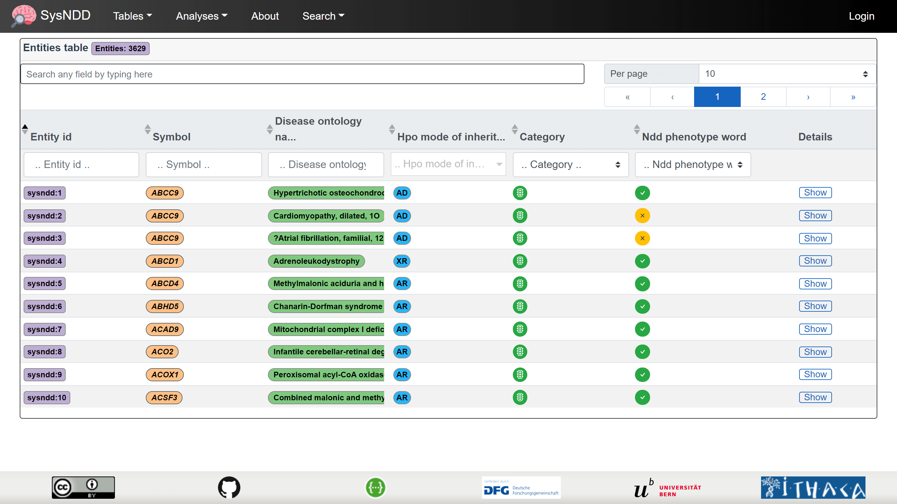{max-width=1000px}

### Genes table

The *Genes* table is intended to provide a gene-centered overview.

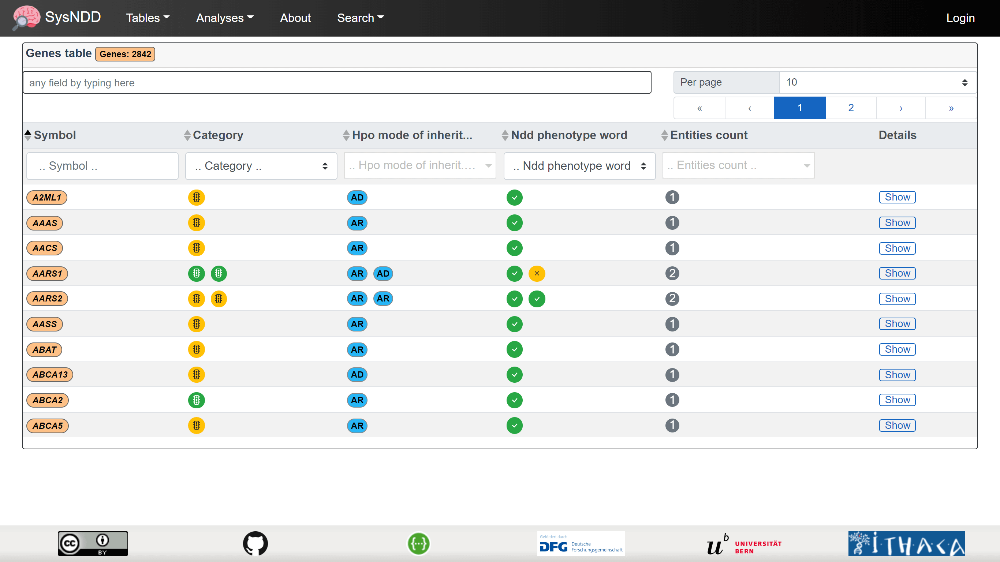{max-width=1000px}

### Phenotypes table

The *Phenotypes* table provides the possibility to filter for phenotype combinations annotated to the entities.

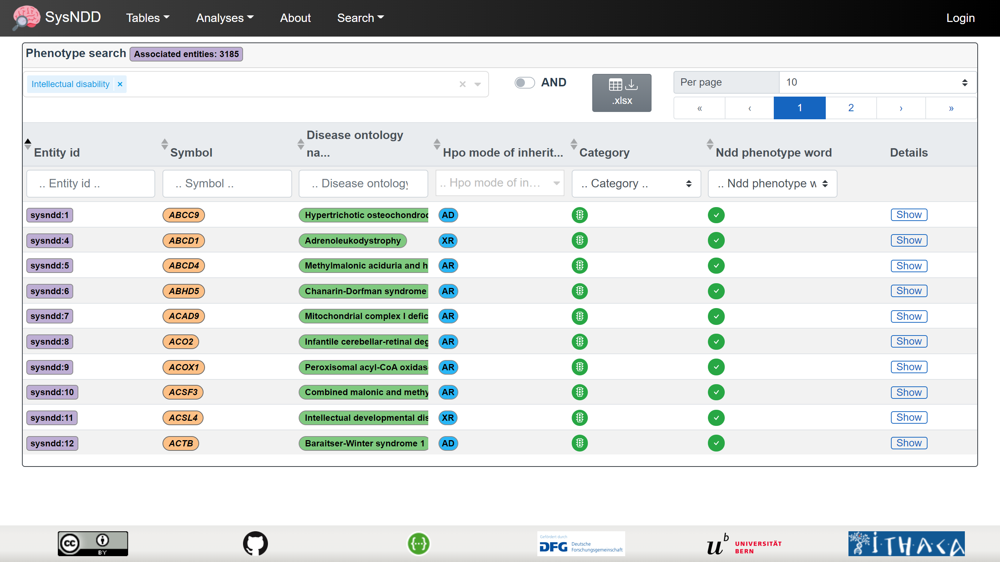{max-width=1000px}

The 'AND/ OR' switch allows the user to change the logic how phenotype combinations are requested:

- AND: only entities having all selected phenotypes annotated are shown
- OR: all entities having any of the selected phenotypes annotated are shown

The *Entities*, *Genes* and *Phenotypes* tables all have the additional two features (top right corner): 

1) Green icon that allows the user to copy the link to the page
2) Yellow icon that allows the use to remove all filters on the table (icon turns blue when all filters are off)

{max-width=1000px}

### Panels table

The *Panels* table is intended for users to be able to create lists of NDD-associated genes. Additionally, the columns in the lists can be configured. Finally, the configuration can be downloaded as an Excel file with information on the exact query in the meta sheet and the requested information in the data sheet. These files can then be used as 'virtual panels' to filter genetic variants derived from high-throughput sequencing in external analysis tools.

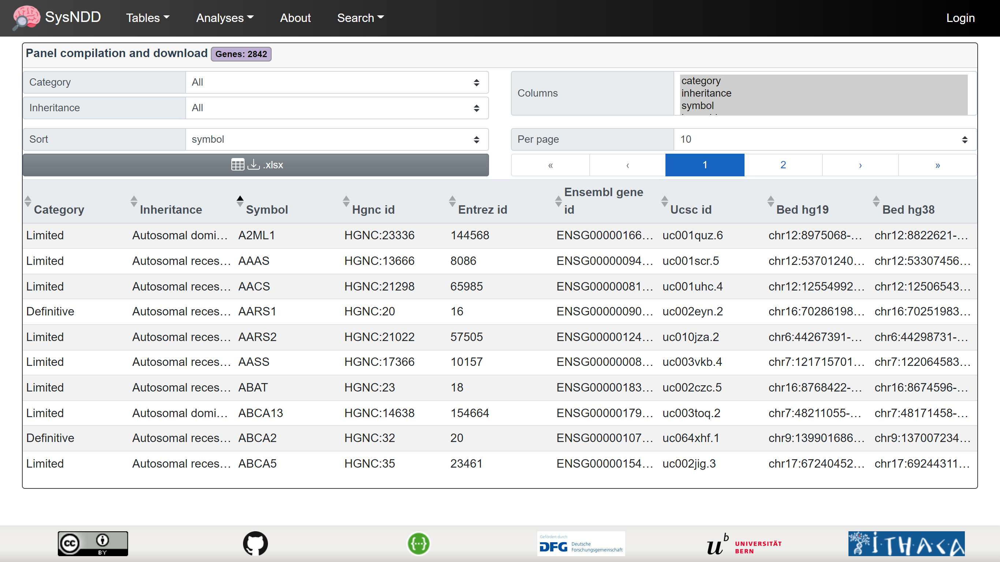{max-width=1000px}

## Single entry pages

Single entry pages refer to the directed pages associated with each entity, gene or disease ontology. These are accessed clicking on the entity (purple), gene (orange) or disease (green) buttons associated with each entry.   

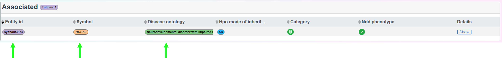{max-width=1000px}

### Entity

The *Entity* page aims to provide information on the gene, disease (with the OMIM link), inheritance pattern and NDD status associated with a particular entity. The synopsis and phenotypes of the disease as well as the relevant links to publications (including GeneReviews if available) are also provided.    

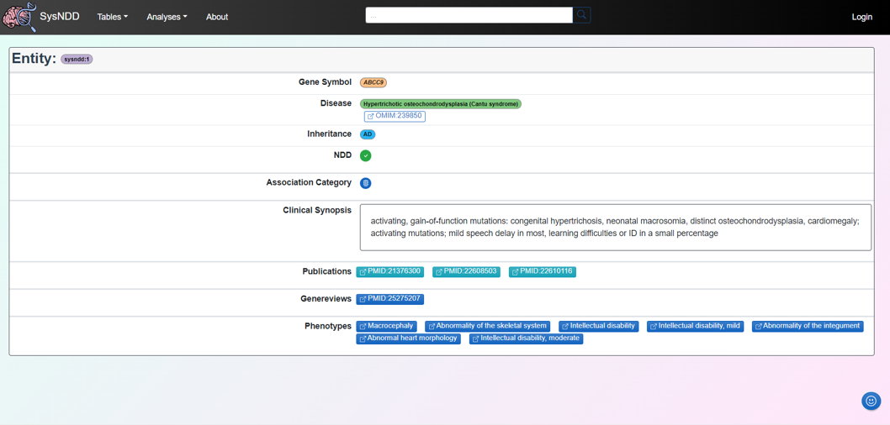{max-width=1000px}

### Gene

The *Gene* page aims to provide further information on 1) the gene of interest with links to other platforms such as Entrez, Ensembl, UCSC, CCDS, UniProt, OMIM gene, MGI, RGD and STRING,  and 2) the entities associated with the gene in a table format.

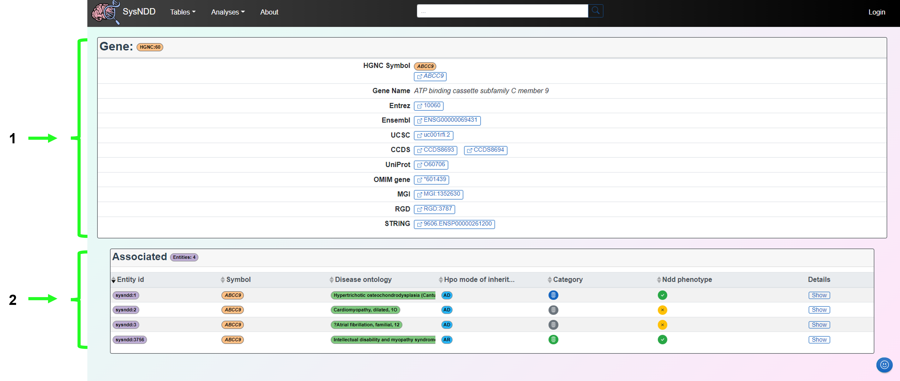{max-width=1000px}

### Ontology

The *Ontology* page aims to provide further information on 1) the inheritance pattern of a disease as well as links to other platforms such as OMIM, DOID, MONDO and Orphanet, and 2) the entities associated with it in a table format. 

{max-width=1000px}

## Analyses views

*Analyses* views are aimed at allowing the use to have a more global picture on comparisons of SysNDD with other curations, phenotype correlations, SysNDD entries over time, NDD publications and functional gene clusters. 

### Compare curations

*Compare curations* view is composed of three tabs: 

1) *Overlap*
2) *Similarity*
3) *Table*

The *Overlap* tab includes an upset plot to show the overlap between SysNDD and other selected NDD curation efforts.  

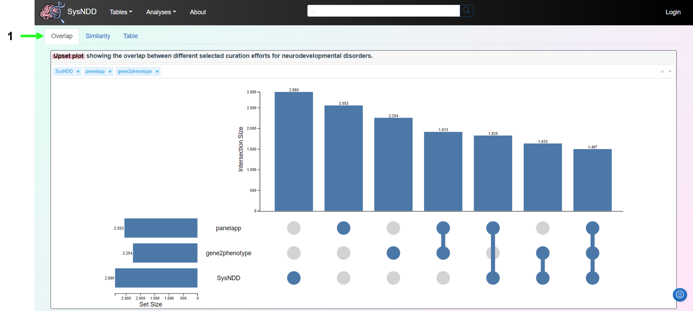{max-width=1000px}

The *Similarity* tab includes a matrix plot of the cosine similarity between different curation efforts for neurodevelopmental disorders.

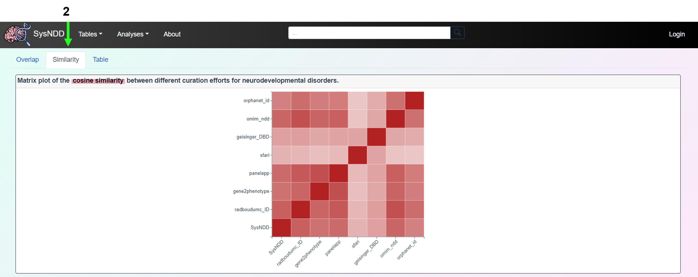{max-width=1000px}

The *Table* tab displays a table format to compare the presence of a gene in different curation efforts for neurodevelopmental disorders. This tab has an additional feature that allows the comparison table to be downloaded as an Excel file. The filter removal button is located at the top right corner.

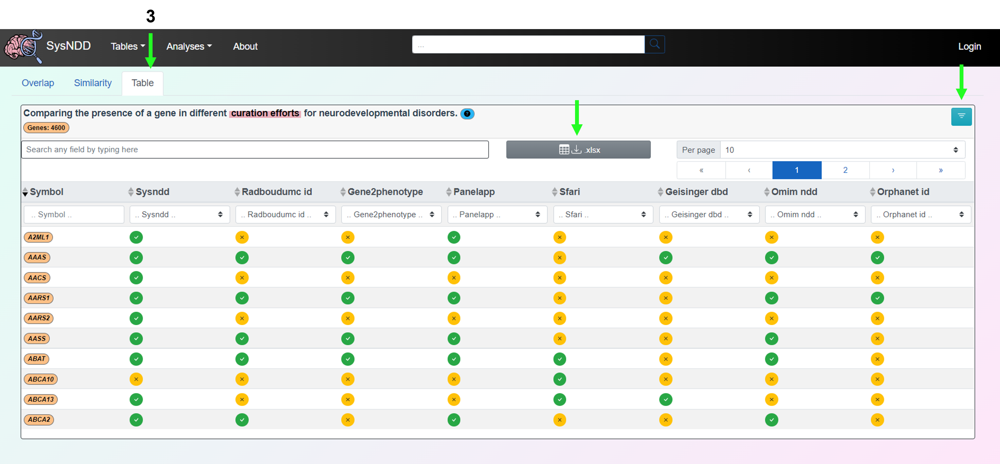{max-width=1000px}

### Correlate phenotypes

*Correlate phenotypes* view is composed of three tabs: 

1) *Phenotype correlogram*
2) *Phenotype counts*
3) *Phenotype clustering*

The *Phenotype correlogram* tab displays a matrix of correlations of different phenotypes.

{max-width=1000px}

The *Phenotype counts* tab shows a bar plot of phenotype counts.  

{max-width=1000px}

The *Phenotype clustering* tab shows clusters of entities based on phenotype annotations.  

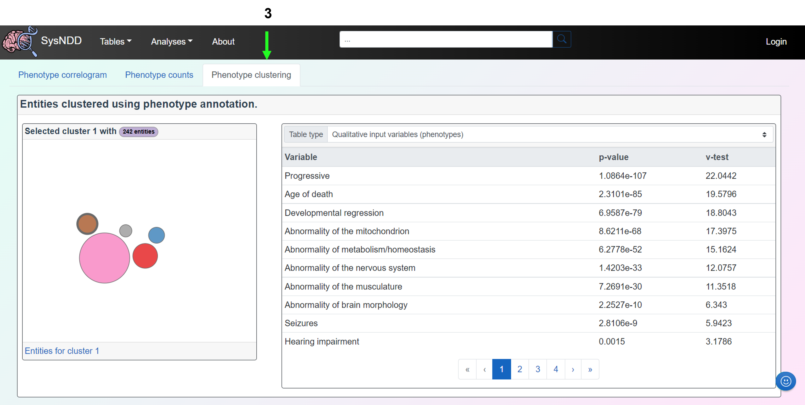{max-width=1000px}

### Entries over time

*Entries over time* view shows the changes in the NDD entity numbers since 2011. 

{max-width=1000px}

### NDD Publications

### Functional clusters

*Functional clusters* view shows the functionally enriched gene clusters.

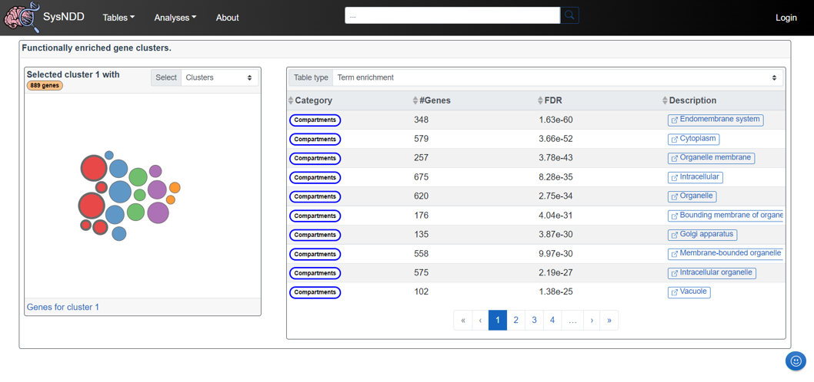{max-width=1000px}

## About page

The About page contains general information about the project, its creators, funding, updates, and how to find help.

## Help & feedback

## Login page

The Login page shows a simple form with inputs for the **(1)**  user name and their **(2)**  password,  **(3)** buttons to reset the form and  **(4)** links to registration and password reset.

{max-width=400px}

### Register user page

This page can be used to apply for a SysNDD account by entering following information:

1) desired username
2) institutional E-mail
3) ORCID identifier
4) First name
5) Family name
6) description of your interest in SysNDD and why you want to participate in the curation effort

and **(7)** accepting the terms of use.

The **(8)** buttons allow resetting or submitting the form.

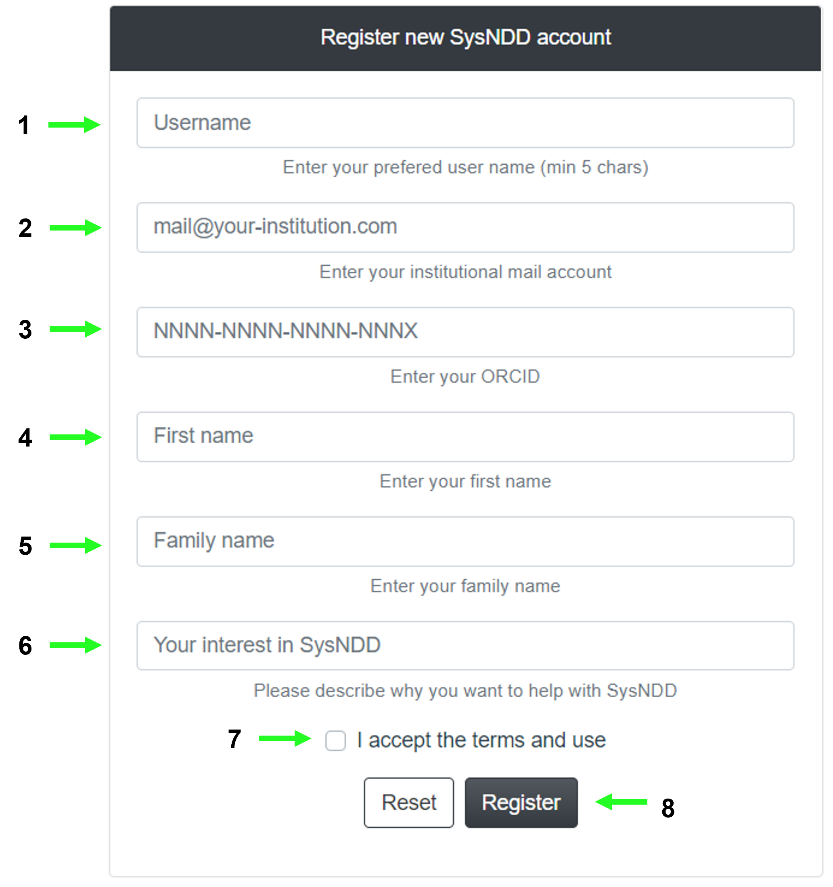{max-width=400px}

Upon submission the curator status users will receive a mail to review your application. After your application has been confirmed you will receive a mail with your login information and instructions.

### Reset password page

The form on this page allows users who forgot their password to reset this by enetering the E-mail tehy registered with.

{max-width=400px}

Upon submission the E-mail account will receive a message with a one-time link allowing the user to enter a new password.

## Mobile website

The Vue.js framework enables native cross platform development. Together with the Bootstrap CSS library this enables the SysNDD web app to seamlessly integrate on smaller mobile screens.

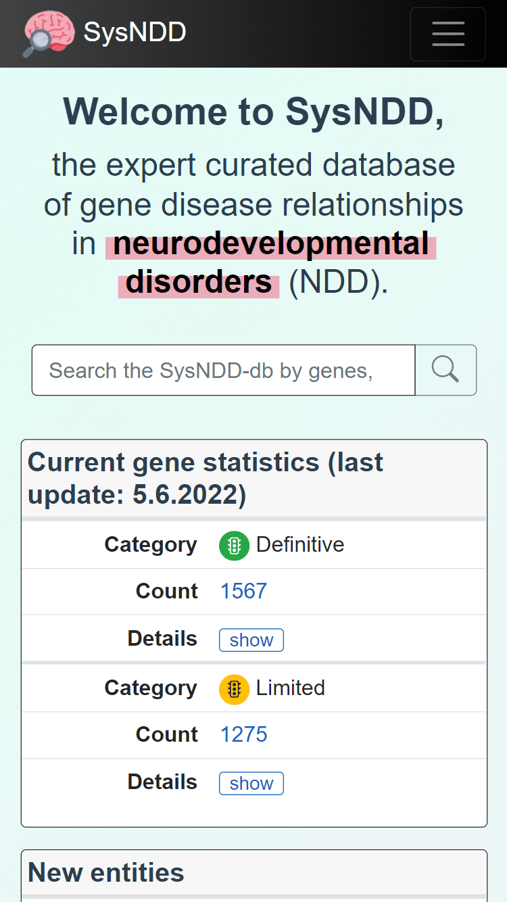{max-width=400px}

The layout breaks to mobile view at 768 pixels width and minimizes the navigation and footer menus:

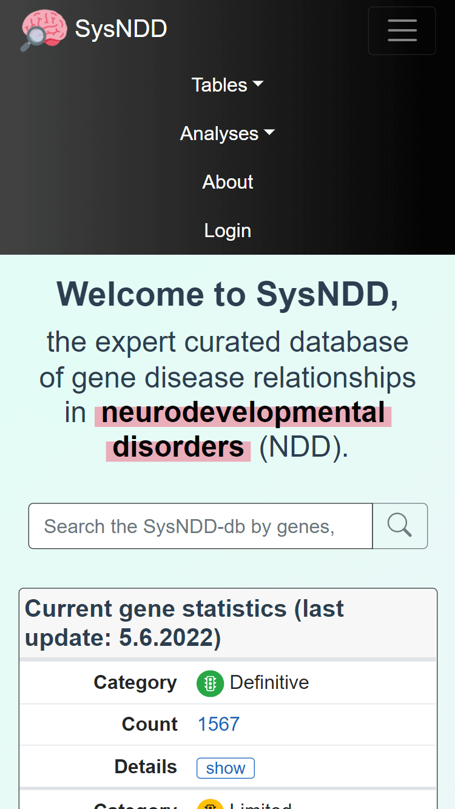{max-width=400px}

{max-width=400px}

All tables in mobile views break to a stacked view (column names becoem first column in a cell and values second column) to best use display space:

{max-width=400px}

The table controls and search inputs are further dispalyed at the top in this view.

The analyses pages on mobile pages are best viewed in landscape mode:

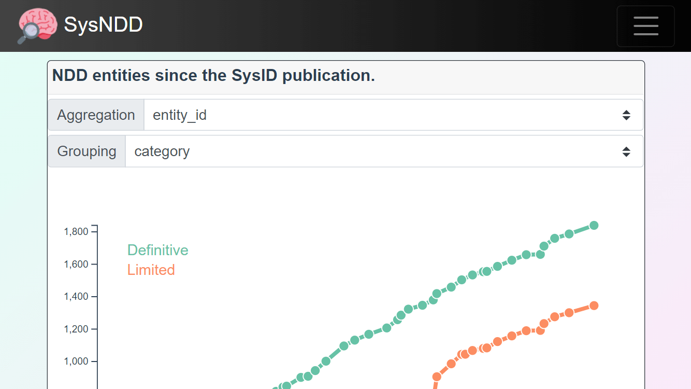{max-width=400px}

## Progressive Web App (PWA)

The SysNDD web app can also be installed on mobile devices using the Progressive Web App ([PWA](https://en.wikipedia.org/wiki/Progressive_web_application)) technology.
This is supported in all Chromium-based modern browsers (Chrome, Edge, Opera, etc.) on all common operating systems (Windows, Linux, maxOS and Android).
Additionally new Safari versions on iOS show some support for PWA.

PWAs are faster because they cache files. They offer more screen space for the app. Future integrations of this feature in SysNDD will enable offline use. 

To install the PWA on Android devices follow these steps:

**1)** Visit the SysNDD website at [https://sysndd.dbmr.unibe.ch/](https://sysndd.dbmr.unibe.ch/). You will see a message offering to add the PWA to your home screen:

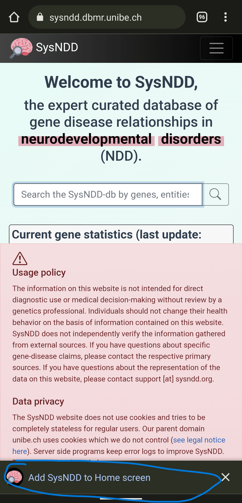{max-width=300px}

**2)** After clicking the previous message, confirm the installation by clicking "Install" in the following prompt:

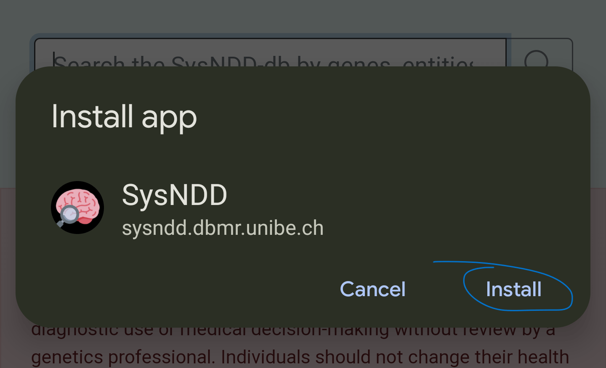{max-width=300px}

**3)** A message will confirm the installation:

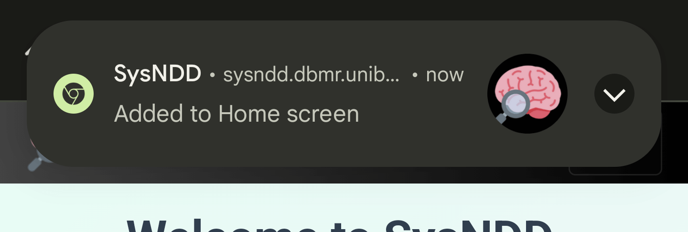{max-width=300px}

**4)** Following app symbol will be available on one of your screens:

{max-width=300px}

**5)** Clicking this will open SysNDD in PWA mode (no browser adress bar, instead custom colored top bar):

{max-width=300px}

## Performance

Modern Javascript frameworks like Vue.js, which we use for the SysNDD website, offer rich user experience. The generated single-page applications can be slower then server side rendered pages.

With SysNDD we are engaged to provide a fast user experience by reducing component and request sizes and applying techniques like lazy loading and code splitting in the frontend with parallelisation in the api.

A quick overview on the current website performance can be obtained on PageSpeed Insights (or "Lighthouse" in the chrome development console):

[https://pagespeed.web.dev/report?url=https%3A%2F%2Fsysndd.dbmr.unibe.ch%2F](https://pagespeed.web.dev/report?url=https%3A%2F%2Fsysndd.dbmr.unibe.ch%2F&form_factor=desktop)

## Security

SysNDD is engaged to offer highest security standards for all web tools.
We use HTTPS with Transport Layer Security (TLS) and follow the mozilla recommendations for web server settings. 

A quick overview for our security settings for the SysNDD website can be obtained on Mozilla Oservatory:

[https://observatory.mozilla.org/analyze/sysndd.dbmr.unibe.ch](https://observatory.mozilla.org/analyze/sysndd.dbmr.unibe.ch)