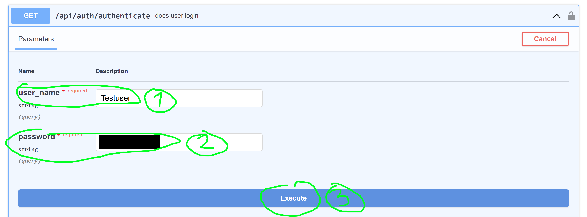
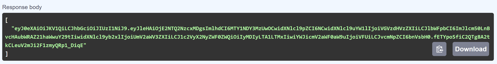
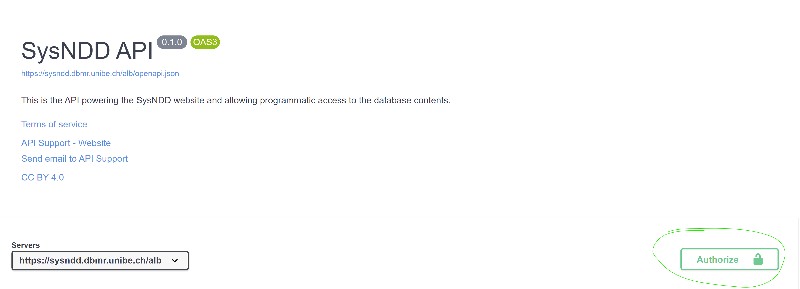
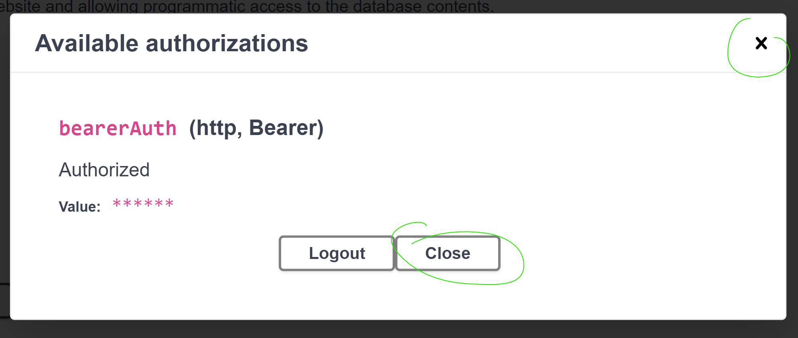
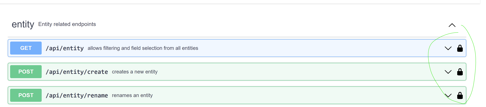

# API {#api}

---

The SysNDD api (application programming interface) is available from [https://sysndd.dbmr.unibe.ch/API](https://sysndd.dbmr.unibe.ch/API).

The api is written in R using the [plumber package](https://www.rplumber.io/).

We intend to follow the [Swagger/ OpenAPI](https://swagger.io/specification/) and [JSON:API](https://jsonapi.org/) specifications.

The api scripts run in a Docker container using the official "rocker/tidyverse" image (version 4.2.0).

As R is single threaded, we deploy multiple instances of the api container. These are bundled together using [HAProxy](http://www.haproxy.org/) load balancer.

The api is rate limited through our [NGINX](https://www.nginx.com/) web server configuration with a rate limit of 10 requests per second (10r/s; equals 1 request every 100 milliseconds) per requesting ip. The configuration allows bursts of up to 30r/s but introduces a delay after 10 requests to enforce the rate limit.

### Endpoints

The SysNDD api currently contains all endpoints for externala nd internal usage in one api script. This may change with future releases.

The api is structured into different components based on the SysND concept:

- entity: Entity related endpoints
- review: Reviews related endpoints
- status: Status related endpoints
- re_review: Re-review related endpoints
- publication: Publication related endpoints
- gene: Gene related endpoints
- ontology: Ontology related endpoints
- inheritance: Inheritance related endpoints
- phenotype: Phenoptype related endpoints
- panels: Gene panel related endpoints
- comparisons: NDD gene list comparisons related endpoints
- search: Database search related endpoints
- list: Database list related endpoints
- statistics: Database statistics
- user: User account related endpoints
- authentication: Authentication related endpoints

The endpoints are documented and can be tested using the Swagger/ OpenAPI user interface at [https://sysndd.dbmr.unibe.ch/API](https://sysndd.dbmr.unibe.ch/API).
Here one can generate cURL requests to use in external software.

### Usage policy

The SysNDD api powers the web tool for everyday users. We also provide the SysNDD api free to allow users to use the SysNDD data and build on it by creating software or services that connect to our platform.

Usage requirements:

- optimize your requests to stay in the above described limits
- be sensible about re-using data (e.g., store your requests until data is updated on our server)
- use pagination where possible instead of requesting large data chunks (e.g., restrict usage of "all" option in large, potentially blocking list endpoints like "entity" and "gene")
- if you require more api ressources please get in contact

Updates and disclaimer:

- We provide the SysNDD api as is.
- Due to the current development status (version 0.X.Y) we may update or modify the api any time. These changes may affect your use of the api or the way your integration interacts with the api.

### Authentication and authorization

The SysNDD api uses JSON Web Tokens ([JWT](https://jwt.io/)) to implement stateless authentication and authorization.

The api user can manually (test purposes) request a token by entering their login credentials in the input form provided at the "api/auth/authenticate" endpoint:

This endpoint will generate and respond with and JWT token:

This Bearer token can then be copied and entered in the OpenAPI/ Swagger authorize modal, which opens after clicking the "Authorize" modal button at the upper right corner:

After entering the token in the respective field (1) and clicking the "Authorize" submission button the modal will change and show the login status. This field can be closed now:

The user is now fully authenticated and can access the endpoints requiring user rights:

The token is valid for 60 minutes. It can be refreshed using the endpoint "api/auth/refresh".

