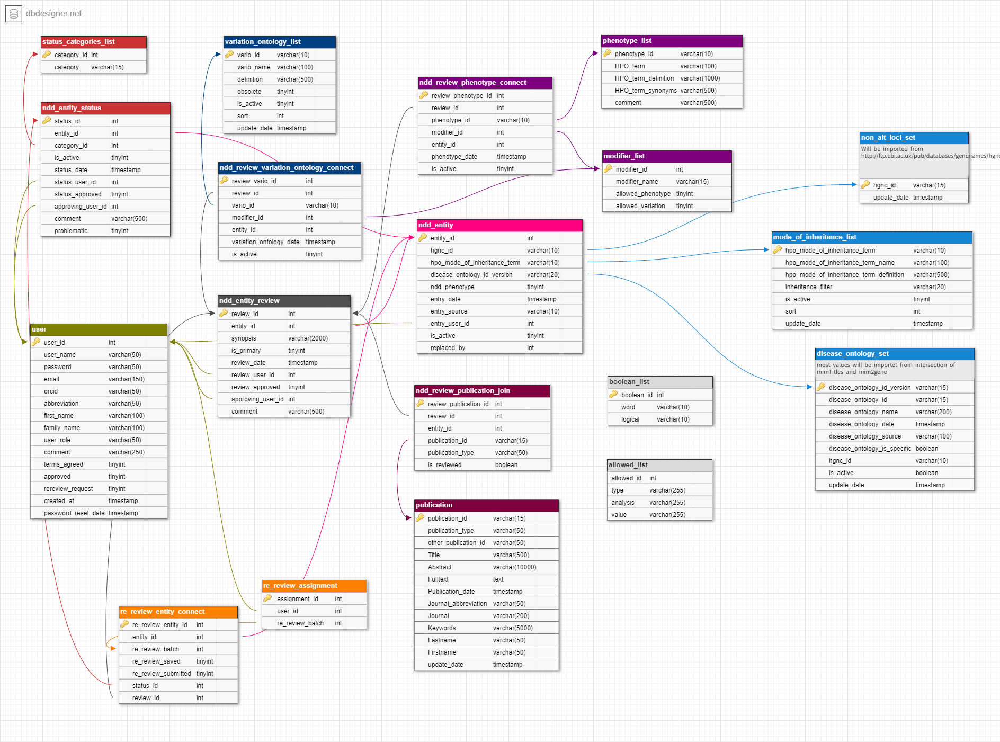

# Database and data sources {#database-structure}

```{r setup, include=FALSE}
knitr::opts_chunk$set(echo = TRUE)
## Load libraries
library(readxl) # needed to import Excel file with ontology lists
library(tidyverse) # needed to transform the tables
library(DT) # needed to generate nice data tables in html
```

```{r, echo=FALSE, message=FALSE, warning=FALSE}
## load the data
variation_ontology_list <- read_excel("data/lists_2022-05-03.xlsx", 
    sheet = "variation_ontology_list")
```
---

## Database software 

SysNDD currently uses the open-source [MySQL 8.0](https://dev.mysql.com/doc/relnotes/mysql/8.0/en/) relational database management system (RDBMS).
The database runs in a docker container using the [official mysql docker image](https://hub.docker.com/_/mysql) (version 8.0.29).

## Database schema

The design of our DB schema can be viewed in [DB DESIGNER](https://www.dbdesigner.net/):

<div style="max-width:1000px;">
[SysNDD DB schema](https://dbdesigner.page.link/3Morx9HZxzqt4R379)
</div>

As of 2022-06-07 the database schema looks like this:

<div style="max-width:1000px;">

</div>


## Variant ontology

We use the "Variation Ontology" as ontology for the annotation of variation effects and mechanisms.
Currently active terms are represented in following table.

```{r, echo=FALSE}

variation_ontology_list_filtered <- variation_ontology_list %>%
  filter(use == TRUE) %>%
  mutate(definition = str_remove_all(definition, " \\[\\]")) %>%
  mutate(vario_id = paste0('<a href="https://www.ebi.ac.uk/ols/ontologies/vario/terms?iri=http://purl.obolibrary.org/obo/', str_replace_all(vario_id, "\\:", "\\_"), '" target="_blank" >', vario_id, '</a>')) %>%
  arrange(sort) %>%
  select(-use, -sort)

datatable(variation_ontology_list_filtered, filter = 'top', escape = F)
```
