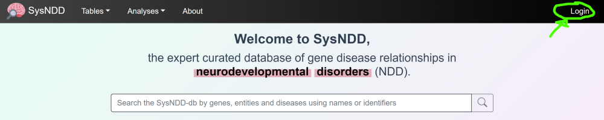
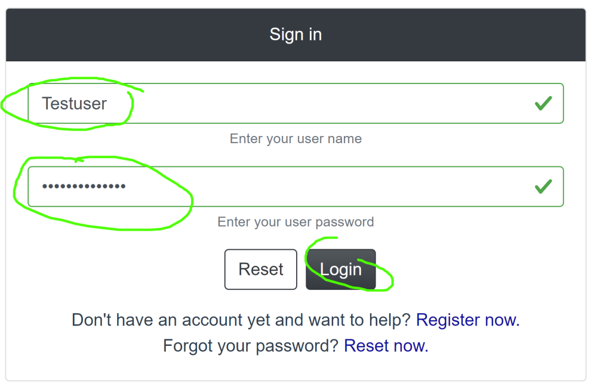
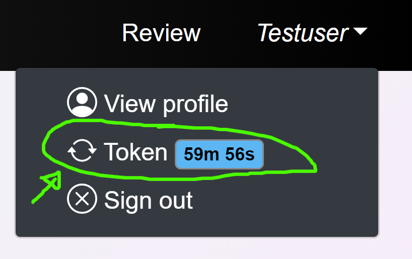
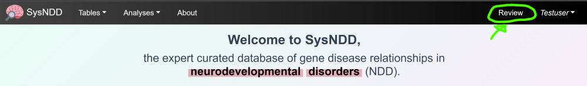
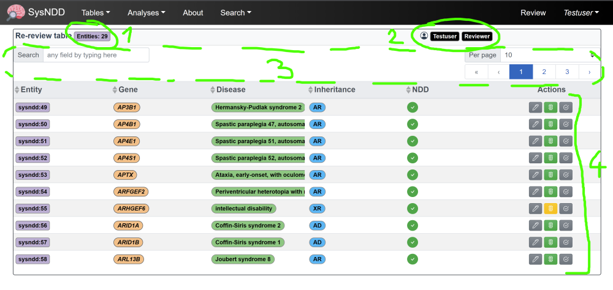
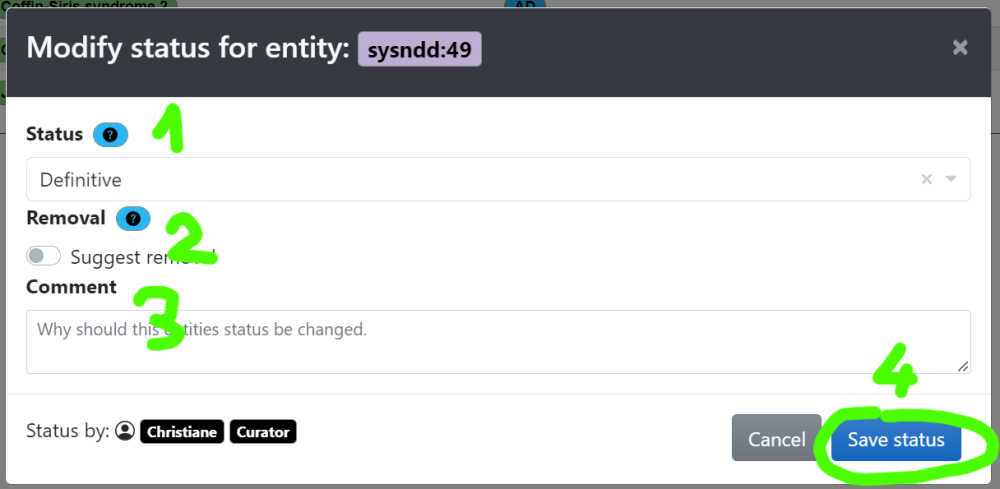
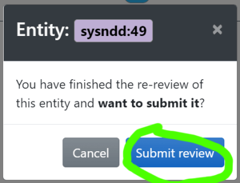

# Re-review instructions

---

The goal of the SysNDD “Re-Review” effort is to update and standardize the SysID entities collected during the past years to enable better integration into and inter-operability international with gene curations.

## Re-review tool usage
We created Reviewer status accounts for participating scientists. 

### Login
You can log into your account by pointing your browser to https://sysndd.dbmr.unibe.ch/ and then clicking the “Login“ link on the right side of the menu:

 
On the Login page enter your credentials and press the Login button:

 
After successful login, you will be redirected to the start page and the navigation bar will show new links depending on your account privileges:

Your login token (JWT; JSON Web Token) is valid for 1 hour, after which you will be logged out. You can however always refresh the time by clicking the link in the user menu. The website will warn you at 5, 3 and 1 minutes before log out.

### Review page

Click the “Review” link to your personal “Re-Review” site:

 
The “Re-Review” page is structured as a table enriched with information and controls.

 
These show you the number of entities assigned to your account

&nbsp;&nbsp;&nbsp;&nbsp; **(1)** your account information status specific controls (e.g. switching to “Curator” mode, applying for a new batch of entities)

&nbsp;&nbsp;&nbsp;&nbsp; **(2)** menu items to filter/ navigate the table

&nbsp;&nbsp;&nbsp;&nbsp; **(3)** and finally, the table with the entity information and

&nbsp;&nbsp;&nbsp;&nbsp; **(4)** controls to review and change the information:

 
By clicking the action buttons, you can open 3 different windows to change the entities review:

&nbsp;&nbsp;&nbsp;&nbsp; **(1)** entities review ()

&nbsp;&nbsp;&nbsp;&nbsp; **(2)** the status ()

&nbsp;&nbsp;&nbsp;&nbsp; **(3)** and to submit your work ()

### New Review edit

In this window you have:

- the possibility to change/adapt or completely rewrite the current synopsis **(1)**,
- add, or remove phenotype associations **(2)**,
- add or remove publications from the review by PMID **(3)**
- and add/ edit fitting GeneReviews articles by PMID **(4)**.
- Finally, you can add a comment to your review for the Curator later approving this entities changes **(5)** and
- save your review **(6)**. 

By clicking on the little question marks you can show help messages for each item:

 
These help instructions are: 

**Synopsis**: Short summary for this disease entity. Please include information on: a) approximate number of patients described in literature, b) nature of reported variants, b) severity of intellectual disability, c) further phenotypic aspects (if possible with frequencies) d) any valuable further information (e.g. genotype-phenotype correlations).

&nbsp;&nbsp;&nbsp;&nbsp; Examples: 

> *de novo* truncating or missense variants in > 20 individuals: variable ID (mild to severe), 50% short stature and microcephaly, 30% seizures, non-specific facial dysmorphism, variable cardiac and renal anomalies in some

> bi-allelic truncating variants in 7 individuals from 3 families: severe ID, microcephaly, seizures in 3/7, MRI anomalies

**Phenotypes**: Add or remove associated phenotypes. Only phenotypes that occur in 20% or more of affected individuals should be included. Please also include information on severity of ID where available and applicable.

**Publications**: No complete catalogue of entity-related literature required! If information in the clinical synopsis is not only based on OMIM entries, please include PMID of the article(s) used as a source for the clinical synopsis.

**GeneReviews**: Please add PMID for GeneReview article if available for this entity.

**Comment**: Additionally add information about your review potentially helpful to the curator approving the entity later.

### New Status edit

In this window you can propose

- to change the entities association confidence category **(1)**,
- suggest its overall removal **(2)**,
- add a comment for your change suggestions for the curators to better understand the proposal **(3)** and
- save your work **(4)**:

### Submit Re-review

The last action window is just to confirm that you are satisfied with your work and would like to submit it for curation:

After clicking this button, the entity will disappear from your list. And you can proceed with the remaining entries until no entity is left in your list.

 
 

## Re-review curation

### Definitive association status

1.	Check if category 1 (“Definitive”) is correct or shift status to category 2 (“Moderate”) or 3 (“Limited”), where appropriate
2.	Check and revise gene-related entities regarding diseases/inheritance patterns (ID and non-ID disorders) --> non-ID disorders will not go into any of the categories but will be tagged with "n.a." (not applicable)
3.	Check and revise associated phenotypes: select HPO terms from the list, only use HPO term if this specific aspect is present in approximately >= 20% of patients. Please also check and revise severity of ID using HPO terms. If ID is very variable, select all appropriate ID terms (e.g. severe, moderate, mild, borderline)
4.	Check references (OMIM, PMID, GeneReviews). References do not have to be complete but should be sufficient to give a good impression on the mutational and clinical spectrum. Add references where it would add to the picture.
5.	Check and revise clinical synopsis: it does not have to contain everything that is known but should give a short and comprehensive picture on:
- which data the gene and disease category were chosen on and 
- the molecular and clinical picture. 

Please include information on:

a) approximate number of patients described in literature, 
b) nature of reported variants,
c) severity of intellectual disability, 
d) further phenotypic aspects (if possible with frequencies), 
e) any valuable further information (e.g. genotype-phenotype correlations) 

Examples:

> *de novo* truncating or missense variants in > 20 individuals: variable ID (mild to severe), 50% short stature and microcephaly, 30% seizures, non-specific facial dysmorphism, variable cardiac and renal anomalies in some

> bi-allelic truncating variants in 7 individuals from 3 families: severe ID, microcephaly, seizures in 3/7, MRI anomalies

### Moderate and Limited association status

-	Check if inclusion criteria for candidate genes are still fulfilled or if it should be deleted from the list (“Refuted”)
-	Check if candidate status is still correct and sort it into Category 2 (“Moderate”) and 3 (“Limited”) (or reclassify to 1 (“Definitive”), if applicable)
-	Check, if associated phenotype still fits
-	Check, if references are correct, if there is any new published information and modify clinical synopsis where appropriate
-	Clinical synopsis can be very short for candidate genes
-	 no associated phenotypes (HPO terms) and frequencies are needed for candidate genes, but could be helpful

Examples:

> *de novo* missense variants in 2 individuals: autism, ID in 50%

> bi-allelic missense variant in 2 affected individuals from 1 family: moderate ID, MRI anomalies

### Refuted association status

-	Check if there is current evidence against this gene association (e.g. few truncating variants described in old publications before gnomAD constrain scores and the gene now has a pLI of 0; genes reported in a family with later report of another cause etc.)